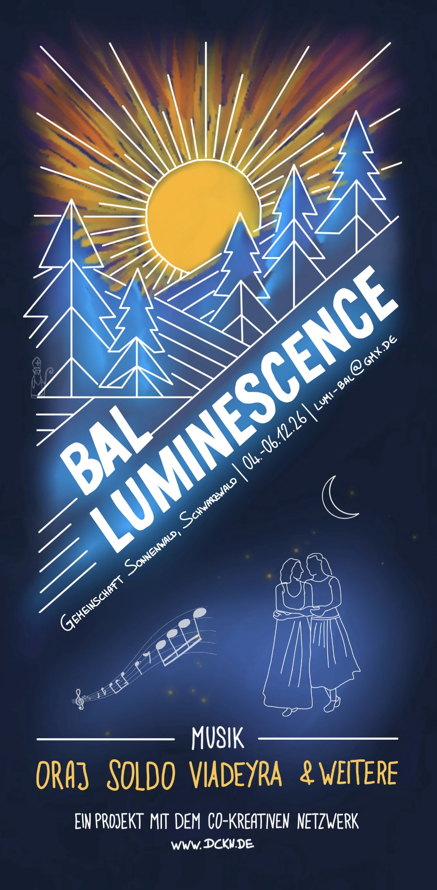
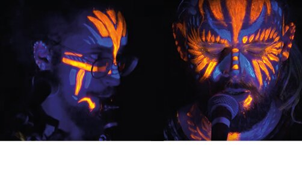
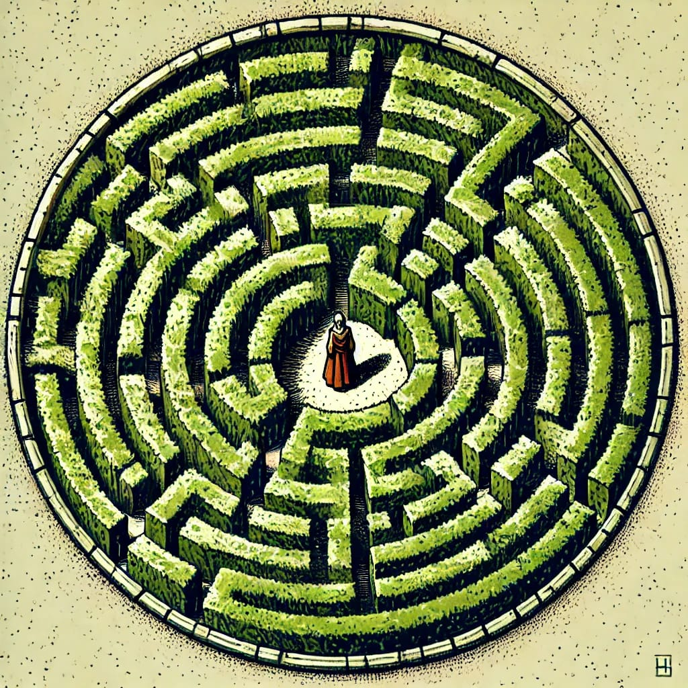
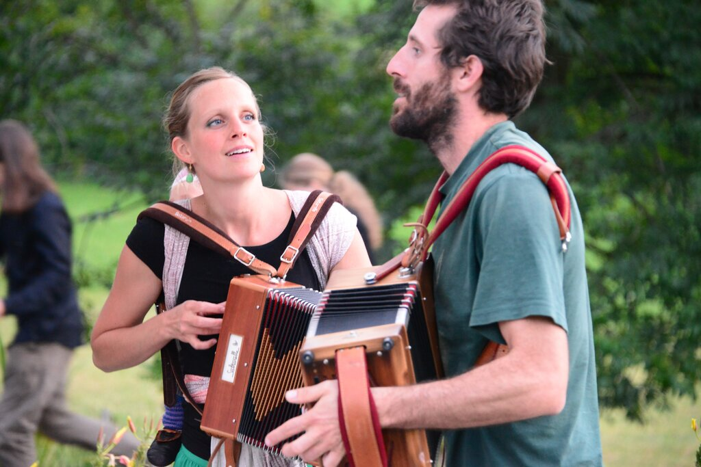
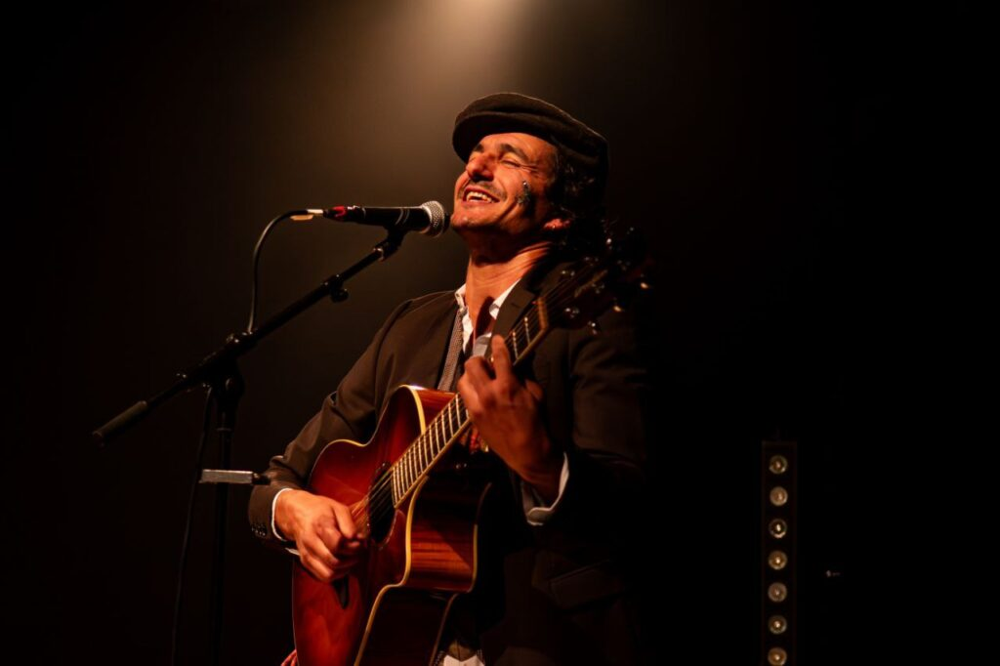

# Bal Luminescence
## 04.-06. Dezember 2026 · Sonnenwald, Schwarzwald

<a class="btn btn-lg" href="https://eveeno.com/lumibal">Anmeldung</a>

[split]
[col]

[/col]
[col]
Liebe Balfolk-Menschen, liebe Freund:innen der Co-Kreation!

Im Südwesten Deutschlands, mitten im Schwarzwald, entsteht gerade ein neues Festival – und zwar genau in der dunkelsten Jahreszeit, wenn wir das Licht der Begegnung am allernötigsten brauchen. Zu diesem laden wir euch herzlich ein und freuen uns auf euer Kommen!

Der Bal Luminescence, liebevoll „Lumi Bal" genannt, findet vom 4. bis 6. Dezember 2026 in der Lebensgemeinschaft Sonnenwald in Seewald statt. Drei Tage tanzen, Musik, gutes Essen, neue und alte Freundschaften – und ganz viel Licht mitten im Winter.

## Mitmach-Festival

Wie alle unsere DCKN-Festivals lebt auch der Lumi Bal von euch. Es gibt kein festes Workshop-Programm von oben – das entsteht gemeinsam, vor Ort, aus dem, was ihr mitbringt: ob Tanz, Musik, Handwerk, Bewegung oder einfach eure Energie. Bringt eure Ideen, euer Können und eure Lust am Ausprobieren mit – denn dieses Festival entsteht erst durch euch.

## Der Ort

Eine kleine Turnhalle wird gemeinsam mit dem Speisesaal zum Ballsaal, dazu eine große Küche mit jeder Menge guter, regionaler Zutaten, die wir gemeinsam zu Festmählern verarbeiten. Beheizte Matratzenlager, zwei Workshop-Spaces und eine kleine Sauna zum Ausklingen der kalten Winternächte runden das Ganze ab.
[/col]
[/split]

## Die Musik

Mit dabei sind unter anderem:

**Sara Bandlow** – eine schweizer Pianistin, die wundervoll mit Klavier und Gesang zum Tanzen einlädt und auf den Advent einstimmt.

[split]
[col]
**ORAJ** – ihre Mischung aus Folk und Elektro holt uns ab, wo wir gerade stehen, nimmt uns mit in eine Trance und bringt uns leuchtend zurück auf die Erde.
[/col]
[col]

[/col]
[/split]

[split]
[col]

[/col]
[col]
**Viadeyra** ist eine musikalische (Wieder-) Entdeckungsreise, die sich den Wurzeln alter traditioneller Musik widmet und durch Tanz wieder zum Leben erweckt. Unsere Musik ist inspiriert von der Viadeyra, einer Form von Poesie und Gesang, die in früheren Jahrhunderten Reisen, Wanderungen und Entdeckungen begleitete.

*Alessandro Cornio – Gitarre und Gesang*
*Alessandro Scacchi – Bass*
*Marco Gagliardi – Klarinette und Duduk*

[Youtube](https://www.youtube.com/watch?v=yxygzzCpzmA),
[Youtube](https://www.youtube.com/watch?v=GHjy0mn8RVI)
[/col]
[/split]

[split]
[col]
**SolDo** – ein Schweizer Duo, das aus zwei Organetti wunderschöne Musik zaubert und zur Lust am Leben, zur Hingabe und zur Begegnung einlädt.
[/col]
[col]

[/col]
[/split]

[split]
[col]

[/col]
[col]
**Gribouille** – wer kennt diesen Typ nicht? Und seine unglaubliche Gitarre?

*Olivier Valence – Gitarre, Gesang*

[Facebook](https://www.facebook.com/profile.php?id=100076243351263&ref=pages_you_manage),
[Youtube](https://www.youtube.com/watch?v=L3G120G5-sE)
[/col]
[/split]

Kommt vorbei, bringt eure Freund:innen mit – wir freuen uns, mit euch gemeinsam zu tanzen und zu leuchten!

## Verpflegung

Für eurer leibliches Wohl ist gesorgt: Zwei Mahlzeiten sind im Ticket inklusive (ein langes Frühstücks-/Brunch-Buffet und eine frische warme Mahlzeit am Abend (aus biologischen und größtenteils von unserer gastgebenden Gemeinschaft selbst erzeugten Produkten)).

Für unser gemeinsames Mitternachtsbuffet freuen wir uns außerdem, wenn ihr noch eine Kleinigkeit zum Teilen mitbringt.
Wir freuen uns über: Kuchen, Kekse, Salami, Käse, Schokolade und alles was ihr sonst noch gerne mögt 🙂

## Übernachtung

Für alle, die bei uns übernachten möchten, gibt es drei Möglichkeiten:

**Schlafsaal**
- Bitte bringt eure eigene Isomatte und einen Schlafsack mit. So könnt ihr es euch nach einem langen Tanztag im beheizten **Schlafsaal** gemütlich machen.

**Gästezimmer**
- Neben der Übernachtung in unserem Festivalbereich besteht auch die Möglichkeit, ein **Zimmer** in der Gemeinschaft separat zu buchen. Die Zimmerbuchung erfolgt direkt über die Webseite der Unterkunft: [https://sonnenwald.org/lernen-tagen/gaestezimmer/](https://sonnenwald.org/lernen-tagen/gaestezimmer/)

**Camping**
- Wer lieber im eigenen Zuhause auf Rädern schläft, kann außerdem mit dem WINTERFESTEN **Wohnmobil** anreisen. Stellplätze sind vorhanden und ein Stromanschluss ist möglich (evtl. gibt es einen kleinen Aufpreis).

Jede Person, die auf dem Gelände der Gemeinschaft Sonnenwald schläft, muss vor Ort noch eine Kurtaxe von 2 € pro Tag zahlen. Diese muss vor Ort und in bar gezahlt werden.

Falls ihr noch irgendwelche Fragen habt oder irgendwo mehr Informationen braucht, scheut euch nicht, uns zu schreiben.

<a class="btn btn-lg" href="https://eveeno.com/lumibal">Anmeldung</a>

