## 2. MärzTanz Festival

### 14. – 16.03.2025

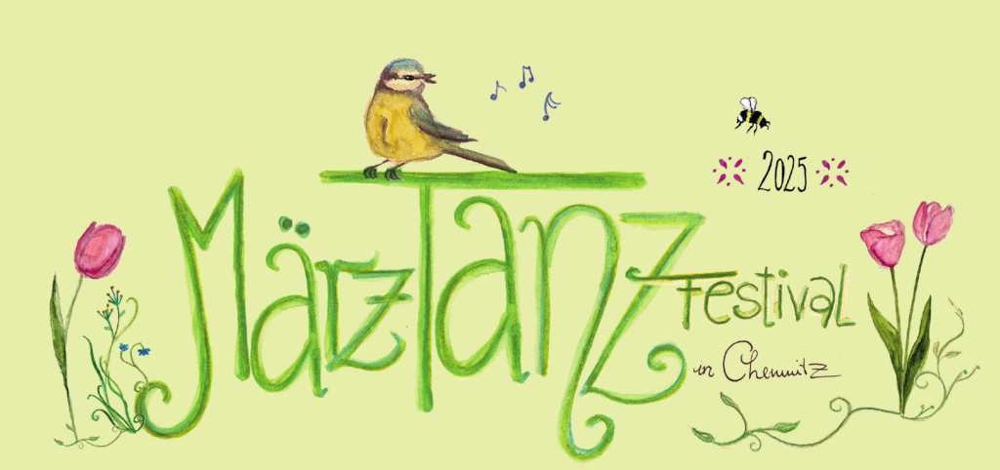

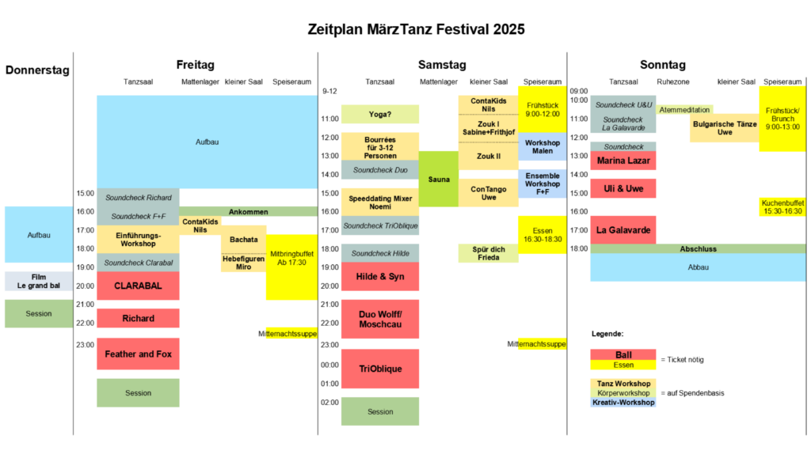

Vielen Dank allen Helfern, Musikern und Tänzern die das Märztanz Festival 2025 möglich gemacht haben.

**Donnerstag** Nachmittag beginnt der Aufbau. Nach dem Helferessen können wir abends (19:30) gemeinsam den **Film** "**Le grand Bal**" schauen und anschließend kann es einen sanften Festivalstart mit Session und Tanz geben.
Freitag ab 16 Uhr ist dann offiziell Einlass. Wer vorher da ist, darf gern noch mit anfassen beim Schönzaubern 🙂

## Bands

### CLARABAL (Halle) – Freitag 19:30

[split]
[col]
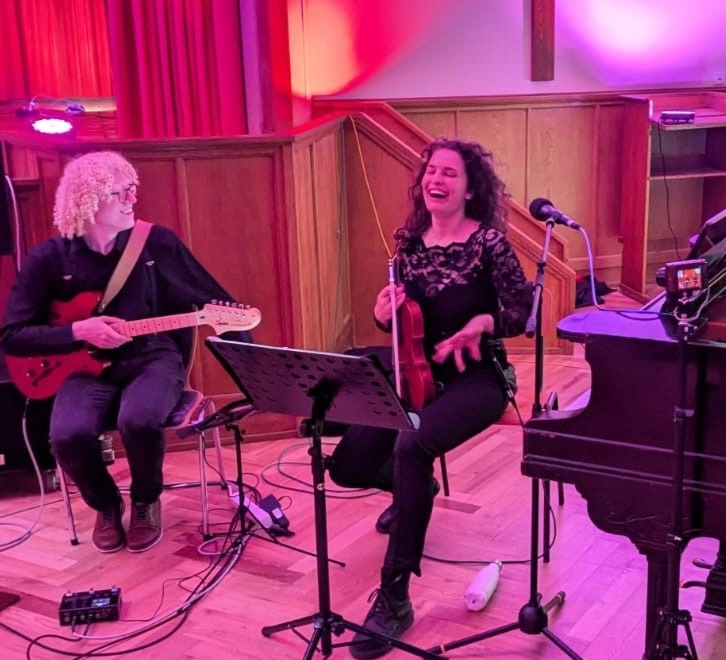
[/col]
[col]
Das Duo hat seine Wurzeln in Halle und seine Flügel in Berlin und anderswo. CLARASCHEIN und Jacob Meussling kreieren mit der Mischung aus tanzbaren Eigenkompositionen und altbekannten Melodien eine musikalische Reise von melancholischen Mazurken bis hin zur fetzigen Polka.
Pop, Jazz und Klassik mischen bei diesem Bal beim Folk ordentlich mit.

*Clara Schein – violin/voc/piano*
*Jacob Meussling – guit*

[Facebook](https://www.facebook.com/clarabalmusic/)
[/col]
[/split]

### Richard (Chemnitz) – Freitag 21:30 Uhr

[split]
[col]
Richard ist ein junger Musiker aus Chemnitz und spielt chromatisches sowie diatonisches Akkordeon. In der Folk-Szene groß geworden, entwickelt er ständig neue Leidenschaften für unterschiedliche Musikrichtungen. Inspirationen liefern von Naragonia bis Astor Piazolla verschiedenste Musiker und Bands aus Europa und der Welt.
[/col]
[col]
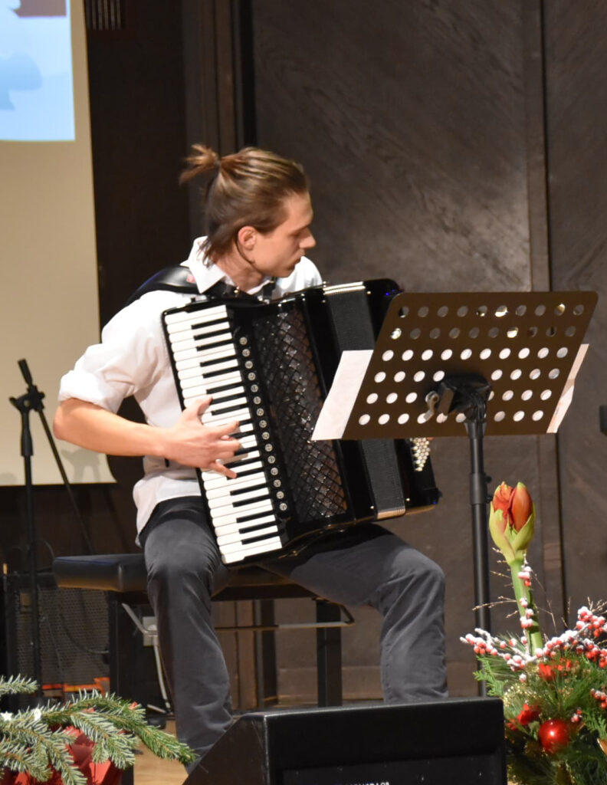
[/col]
[/split]

### Feather and Fox (Berlin und Brüssel) – Freitag 23:00 Uhr

[split]
[col]
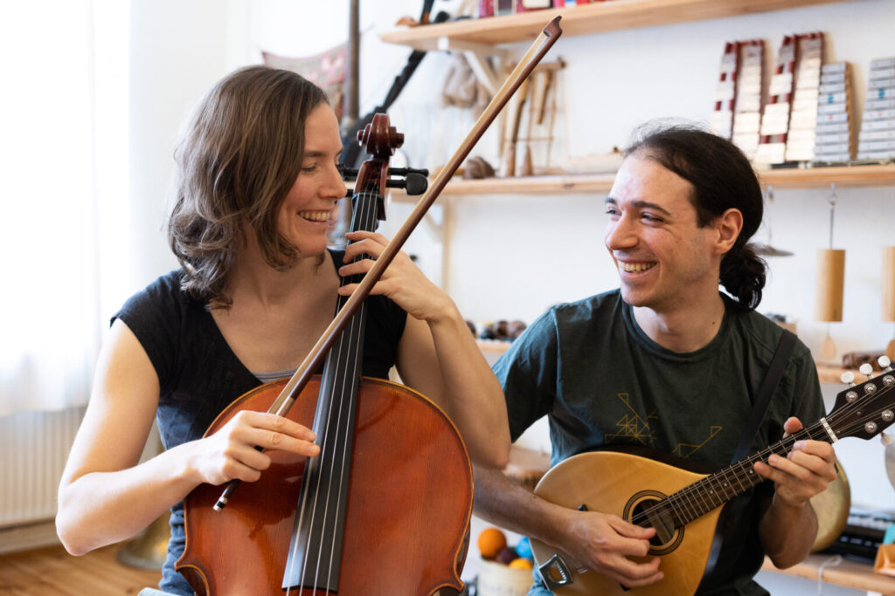
[/col]
[col]
Feather and Fox ist ein belgisch-deutsches Cello und Mandolinenduo. Christiane und Victor lernten sich in einem Berliner Sommer am Spreeufer kennen und reisen seitdem mit ihrer einfühlsamen Musik durch die Balfolkszene Europas. Von Beginn an spielt das Duo für Tänzer:innen und lässt sich von deren Energie inspirieren. Verspielt und feinfühlig erkunden sie die Klangmöglichkeiten im Zusammenspiel der zwölf Saiten ihrer Instrumente und kreieren damit einen einzigartigen Klang, zugleich federleicht und energiegetrieben.

*Christiane Bisitz – Cello, Gesang*
*Victor Lekeu – Mandoline, Percussion*

[Facebook](https://www.facebook.com/featherandfoxduo/)
[/col]
[/split]

### Hilde und Syn – Samstag 19:00 Uhr

[split]
[col]
Hilde Van Belle schreibt kleine flämische Lieder für ein lauschendes und tanzendes Publikum. Begleitet wird sie von Yassine Amrouch an der Nyckelharpa, der den Liedern einen zusätzlichen Glanz verleiht. Erwartet zuckersüße Liebeslieder, verträumte Melodien und ein wärmendes Zusammenspiel.

*Hilde – Piano und Gesang*
*Yassine – Nyckelharpa*
[/col]
[col]
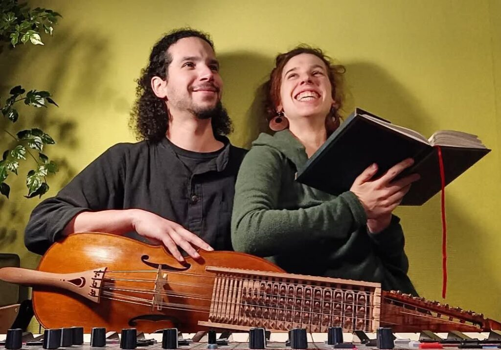
[/col]
[/split]

### Duo Wolff/Moschcau – Samstag 21:00 Uhr

Hier treffen sich Geige und diatonisches Akkordeon und lassen Melodien erstrahlen, die voller Wärme und Lebendigkeit zum Bal Folk einladen. Mit Karola Wolff und Thomas Moschcau haben sich in diesem Duo zwei Musiker zusammengetan, die selbst gern tanzen.

*Karola Wolff – Geige*
*Thomas Moschcau – diat. Akkordeon*

### TriOblique (IT/F) – Samstag 23:30 Uhr

[split]
[col]
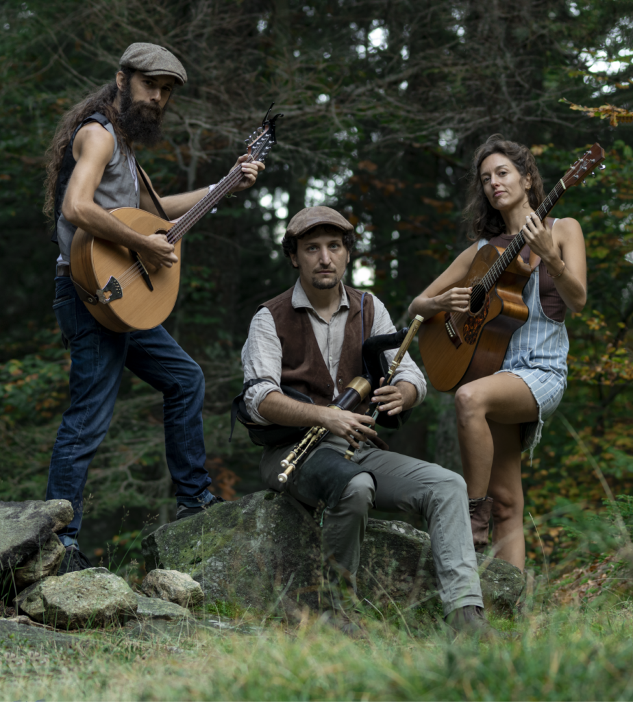
[/col]
[col]
Diese drei Musiker bringen die Welt zum Tanzen. TriOblique kombiniert Gitarre, irische Bouzouki, irische Flöten und Uillean Pipe. Ihre Musik führt sie auf verschlungenen Pfaden von einem Stil zum nächsten, von Genua nach Irland, vom Funk zur traditionellen Musik aus der Hochbretagne. Sie kombinieren zartes Fingerpicking mit rockigen Akkorden und experimentieren mit verschiedenen Instrumenten und Gesangsstilen. Das Ziel der Band ist es, die Körper der Zuhörer zum Tanzen zu bringen, sei es zu einer schlichten Mazurka oder zu wilden Tänzen wie dem Kost Ar Choat.

*Susanna Roncallo – Gitarre*
*Aurélien Congrega – irische Bouzouki und Gesang*
*Dario Gisotti – Uillean Pipe und Flöten*

[Website](https://triobliquebalfolk.wixsite.com/trioblique)
[/col]
[/split]

### Marina Lazar (BE) – Sonntag 13:00 Uhr

[split]
[col]
Die klassisch ausgebildete Pianistin Marina Lazar nimmt uns mit ihrem Klavier auf eine Reise durch vorwiegend Paartänze des Balfolk.
Wunderbar sanfte Melodien lassen uns durch den Sonntag Mittag schweben.

*Marina Lazar – Piano*

[Website](https://www.marinalazar.com/)
[/col]
[col]
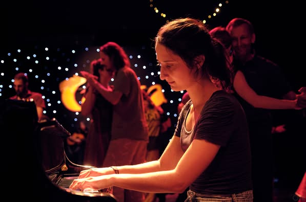
[/col]
[/split]

### Uwe & Uli – Sonntag 14:30 Uhr

[split]
[col]
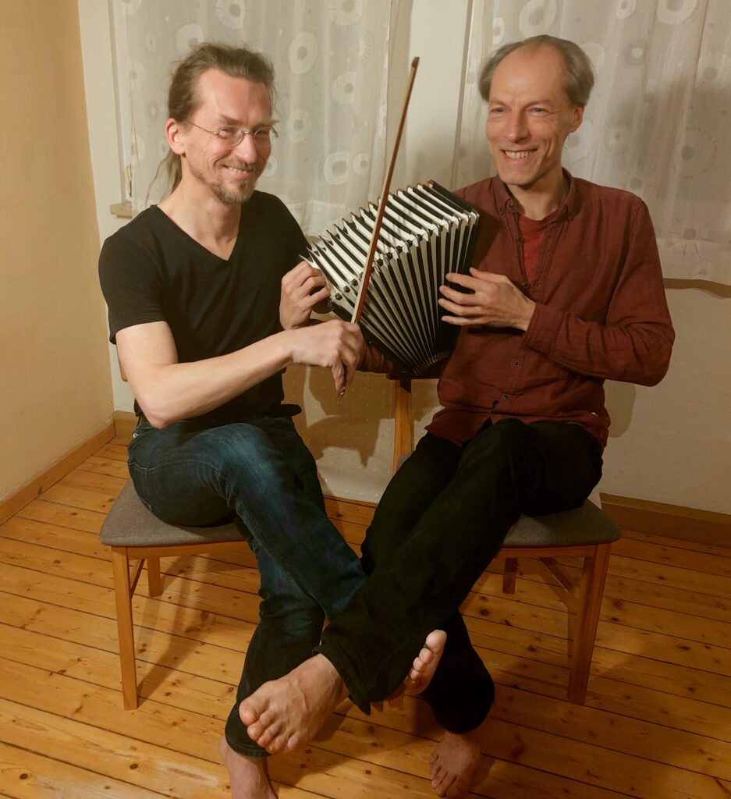
[/col]
[col]
Uwe spielt seit vielen Jahren chromatisches Akkordeon. Recht früh hat er seine Liebe zur Musik vom Balkan entdeckt. Immer wieder zieht es ihn nach Bulgarien, um dort von Musikern und Tänzern in die Feinigkeiten dieser Tradition eingeweiht zu werden.

Das viele Musizieren inspiriert ihn zum Schreiben eigener Melodien und zusätzlicher Stimmen zu traditionellen Stücken. Sein Steckenpferd sind ungerade Rhythmen. Uwe leitet seit mehr als 10 Jahren die Balkantanzgruppe "Gizdava Moma" in Jena.

Uli hat sich als erstes mit schwedischer Tanzmusik und dann zunehmend mit Balfolk-Musik beschäftigt.
Als leidenschaftlicher Tänzer ist er schon mit vielen verschiedenen Rhythmen in Berührung gekommen, die er dann gemeinsam mit Uwe auch auf der Geige umsetzt.

Nun verbinden beide ihre Leidenschaft zur jeweiligen Musikrichtung, indem sie sich gegenseitig "anfeuern", das Tanzvolk zahlreich und ausgelassen auf die Tanzfläche zu holen.
[/col]
[/split]

### La Galavarde (F) – Sonntag 16:00 Uhr

[split]
[col]
La Galavarde ist ein Trio aus Grenoble mit fröhlicher Energie, das seine Inspiration aus dem Klangreichtum von Zentralfrankreich und der Dauphiné schöpft. Ihre drei Musikerinnen, Sarah, Claire und Sidonie, flechten gemeinsam die Klangfarben des Akkordeons, der Geige, der irischen Flöte und ihrer drei Stimmen ein.

[Linktree](https://linktr.ee/lagalavarde)
[/col]
[col]
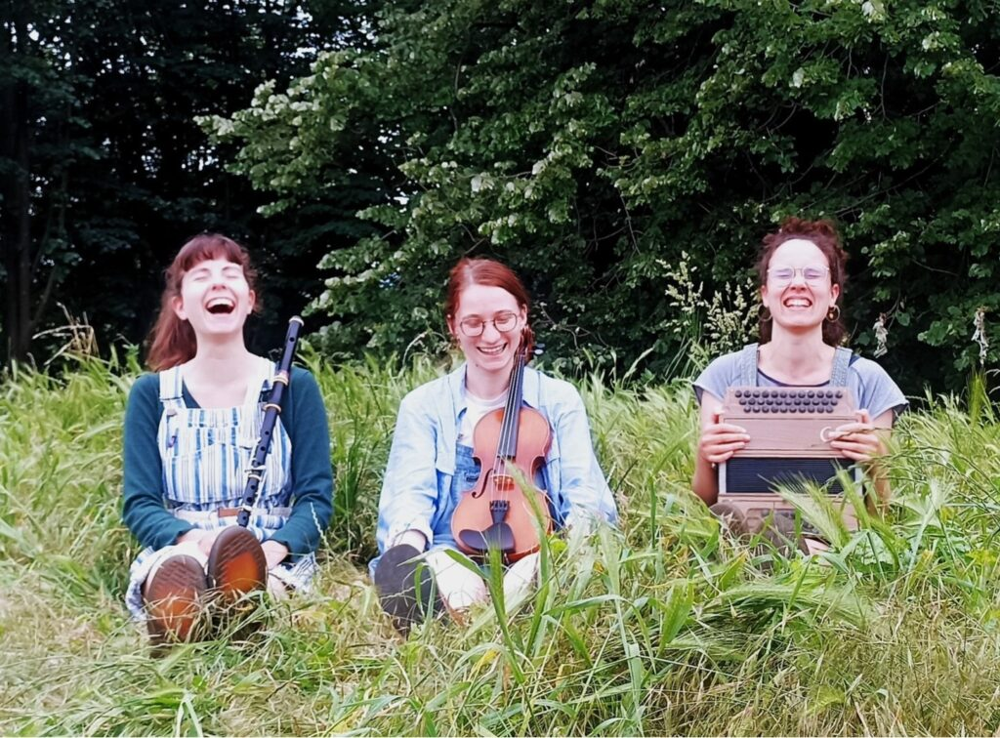
[/col]
[/split]

## Workshops

### Freitag

#### ContaKids – Contact Improvisation für Eltern und Kinder mit Nils – 16:30 Uhr

Bei Contakids steht die Eltern-Kind Interaktion im Mittelpunkt. Durch angeleitete Bewegungsspiele entsteht ein Raum, in dem du deinem Kind auf Augenhöhe begegnen und die intuitive Kommunikation miteinander vertiefen kannst. Dabei entwickelt dein Kind seine motorischen Fähigkeiten weiter und du baust Vertrauen in dein Kind und dich selbst auf. Contakids ist 45 minuten gemeinsames Sein, Du und dein Kind.

Hier gibt es einen Einblick: [Youtube](https://www.youtube.com/watch?v=oW_LR5TDqRo)

Das ideale Alter deines Kindes liegt für Contakids zwischen 2 und 5 Jahren. Ältere Kinder sind aber auch eingeladen, sich an den Spielen mit ihren Eltern auszuprobieren.

#### Balfolk-Einführungsworkshop mit Antonia – 17:00 Uhr

Einführung in die Welt des Balfolk mit Antonia Sophie Balzer. Tänzerin und Musik und Bewegungspädagogin aus Basel und Halle.
[Youtube](https://m.youtube.com/watch?v=nxR3kFf51Qw&pp=ygUkaW50ZXJuYXRpb25hbGUga3JlaXN0w6RuemUgdG9uaXRhbnp0)

#### Bachata mit Sabine und Frithjof – 17:00 Uhr

#### Hebefiguren im Balfolk mit Miro – 18:30 Uhr

### Samstag

#### Zouk mit Sabine und Frithjof – 11:00 Uhr

#### Malen mit Clara – 12:00 Uhr

#### Bourrée für 3-12 Personen mit Antje (begleitet von René auf dem Chello) – 12:00 Uhr

#### Ensemblekurs für Musiker mit Feather and Fox – 14:00 Uhr

In this workshop, we will start with some improvisation games to meet and listen to each other within the group. We will then learn a simple melody by ear and work together to make it more interesting: adding dynamics and accents, finding chords and drones, and putting those together to create a longer arrangement. We will share some of our ideas about all these elements in folk music, and are also looking forward to hearing yours!

The entire workshop will be done by ear. All instruments and levels are welcome.

#### ConTango mit Uwe Fährmann – 14:30 Uhr

#### Speeddating in Chapeloise und Cercle mit Noemi – 15:00 Uhr

#### Spür dich in deinem Körper mit Frieda – 18:00 Uhr

### Sonntag

#### Atemmeditation nach Wim Hof mit Gabi – 10:30 Uhr

#### Bulgarische Tänze mit Uwe Kapell – 11:00 Uhr

## Ort und Anreise

Dieses Jahr tanzen wir im wunderschönen Tanzsaal im [**Haus des Gastes**](https://www.hausdesgastes.info/raumlichkeiten/veranstaltungsraume/) Chemnitz-Reichenbrand. Dort haben wir auch sehr schöne Workshopräume zur Verfügung.

Haus des Gastes Reichenbrand
Zwickauer Straße 485
09117 Chemnitz

- nächster Bahnhof: Chemnitz Siegmar (16 min zu Fuß, Regionalbahn Strecke Zwickau-Dresden)
- nächste Bushaltestelle: Kirche Reichenbrand (direkt gegenüber)
- Autobahnabfahrt A72: Chemnitz Süd (oder Chemnitz Rottluff) (Fahrzeit 6 min)
- Parken: in den umliegenden Straßen kostenlos möglich. Direkt am Haus des Gastes nur wenige Parkmöglichkeiten (der Hof ist für Mitarbeiter und Künstler reserviert)

## Unterkunft

Wir können in der angrenzenden Turnhalle einige Schlafplätze im Matratzenlager (mit eigener Isomatte+Schlafsack) anbieten. Die Pensionszimmer stehen nicht zur Verfügung, da sie langfristig vermietet sind.
In der Nähe gibt es 2 Pensionen, in denen ich Zimmer reserviert habe. (15-20 min zu Fuß)
Außerdem haben wir ein paar Schlafplätze frei, diese sind aber nachts nur mit dem Auto (17min) erreichbar.
Bitte sonst auch selbständig um Übernachtungen kümmern.
Wer Platz bei sich anbieten kann, gibt das in der Anmeldung bitte mit an, dann können wir vielleicht eine Schlafplatzbörse einrichten.

## Verpflegung

[split]
[col]
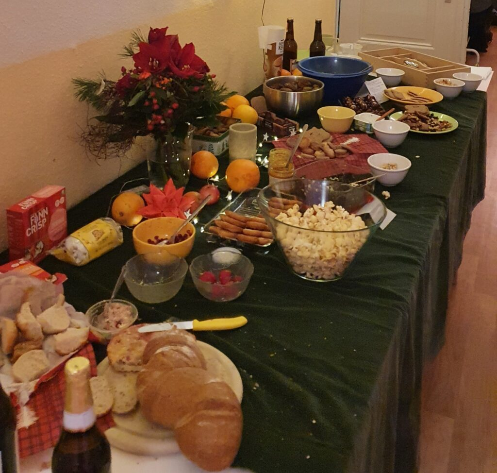
[/col]
[col]
Freitag Abend gestalten wir ein gemeinsames Mitbringbuffet 17:30 – 20:00 Uhr. Bitte beschriftet eure Buffetbeiträge (vegan, vegetarisch, mit Fleisch, Gluten)

Im Festivalpreis inklusive:
Mitternachtssnack Fr
1 warme Mahlzeit Sa 16:30 – 18:30 Uhr
Mitternachtssnack Sa
Sonntag Brunch 9:00-13:00 Uhr

Extra:
Frühstück Sa 9 – 12 Uhr ist bei Bedarf dazubuchbar
[/col]
[/split]

## Kleidertausch / Verschenketisch

Ihr könnt ein paar Kleidungsstücke mitbringen, die nicht mehr getragen werden, aber in gutem Zustand für neue Besitzer sind und sucht euch etwas aus von den vorhandenen Dingen. Kleidungsstücke für Menschen jeden Alters, Schuhe, CDs, Bücher. Es ist auch möglich, nur zu finden.
Was übrig bleibt, geht an Unterstützungsprojekte für Menschen, denen es weniger gut geht im Leben.

Wer nur am Kleidertausch oder einem Workshop teilnehmen möchte, braucht dafür kein Ticket, ist aber herzlich eingeladen, dem Verein eine Spende dazulassen.

## Co-Kreation

…wie ihr sie vom SimmelFolk Festival schon kennt.

Dieses Festival ist ein **Gemeinschaftsprojekt**.
Es lebt mit euch, durch euch, von euch.
Ohne euch gibt es kein Festival.

Jede:r ist eingeladen sich mit ihren/seinen Fähigkeiten, Energie und Präsenz einzubringen, um das Festival mitzugestalten, egal ob als Musiker:in oder Workshopleiter:in, beim Kochen, vorbereiten oder aufräumen.
Jede:r Teilnehmende trägt ein oder zwei kleine "Ämtli", so erschaffen wir ein Balfolk-Festival – das ist Co-Kreation!
In der Anmeldung könnt ihr euch für eine Helferkategorie eintragen.

Meldet euch gern, wenn ihr euch in der Organisation im Vorfeld oder direkt beim Festival mit eigenen Ideen und tatkräftigen Händen einbringen wollt.

## Code of Conduct

Willkommen sind hier Menschen jeglichen Alters – sehr gern in der ganzen Familie, jeglicher Hautfarbe, Herkunft, Glaubensrichtung, Geschlechtsidentität oder sexueller Orientierung.
Du darfst hier so sein, wie du bist. Gewalt und berauschende Drogen haben hier allerdings keinen Platz.
Wir wünschen uns ein friedvolles, unterstützendes Miteinander, wo jede:r auf den anderen Menschen achtet und sie/ihn in seiner/ihrer Einzigartigkeit respektiert.

Beim Tanzen geht es um die Gemeinschaft, nicht um Perfektion. "Dance roles are social constructs." = Tanze in der Rolle, die du möchtest. Du darfst jeden Menschen (egal welchen Alters, Geschlechts, …) zum Tanz bitten und jeder darf die Bitte frei beantworten. Solltest du ein Nein erhalten, betrachte es mit Dankbarkeit. Du hast in dem Moment ein Ja des anderen Menschen zu den eigenen Bedürfnissen erhalten.
Im Tanzsaal ist während des Balls Zeit der Musik zu lauschen und dazu zu tanzen. Für Gespräche gibt es in anderen Räumen und in den Pausen Gelegenheit.
Bitte achtet bei euren Tänzen auch auf eure Umgebung. Manchmal ist nicht genug Platz für sehr ausladende Figuren, dann spart sie euch bitte für Momente mit mehr Platz auf. Wenn ihr euch in eine Kette einreihen wollt, dann bitte am Ende anhängen. In Kreisen im besten Fall schon mit dem aufgenommenen Rhythmus und zu einem günstigen Zeitpunkt einsteigen, um die anderen nicht aus dem Takt zu bringen. Nicht alle tanzen schon seit Jahren und sind in den Tänzen sicher.
Bei Paartänzen, die sich im Raum bewegen, sind die Tänzer, die am Platz tanzen in der Mitte und die Tänzer, die in Tanzrichtung durch den Raum tanzen außen.

Im Ruheraum darf geruht, geschlafen, massiert, gekuschelt werden. Ist niemand zum Schlafen da, dürft ihr dort auch tuscheln.

Bitte geh achtsam mit den Räumen und allen Gegenständen um. Fällt dir etwas auf, was nicht in Ordnung ist oder sollte dir versehentlich etwas kaputt gegangen sein, wäre es schön, wenn du dafür Sorge trägst, dass es in Ordnung kommt oder eine Info an das Orgateam weiterreichst.
Beim Tanz-Wochenende werden Fotos und Videos erstellt und den Teilnehmern zugänglich gemacht. Manche der Daten werden auch öffentlich verwendet. Mit deiner Teilnahme erklärst du dich damit einverstanden. Falls du nicht einverstanden bist, muss die Einwilligung schriftlich bei DCKN e.V. widerrufen werden.

Auf ein schönes gemeinsames Tanzfest!

## Seelenengel

In diesem Jahr wird das Festival von Seelenengeln begleitet. Das sind Menschen, die sich in der Tanzwelt gut auskennen und dich gern unterstützen, wenn du dies brauchst.

Wofür sind die Seelenengel da?

- du bist neu hier, kennst fast niemanden und weißt nicht wohin mit dir
- du würdest so gern mittanzen, traust dich aber nicht
- du hast mit jemandem eine Situation zu klären und benötigst dabei Unterstützung
- jemand hat deine Grenze überschritten und du benötigst Hilfe
- du brauchst jemanden, der dir den Tanz (nochmal) erklärt
- du findest etwas verwirrend und brauchst einen Wegweiser (z.B. welcher Workshop ist wann und wo und wie ist das mit dem Schlafen geplant, …?)
- du fühlst dich gerade nicht wohl und hast Bedarf mit jemandem zu sprechen oder wünschst dir Körperkontakt
- du hast den Eindruck, es gibt irgendwelche unausgesprochenen Dinge, die nur du nicht verstehst

In all diesen Fällen helfen dir unsere Seelenengel weiter.
