## Tanz und Verbindung 2026

**22. – 25.05.2026**

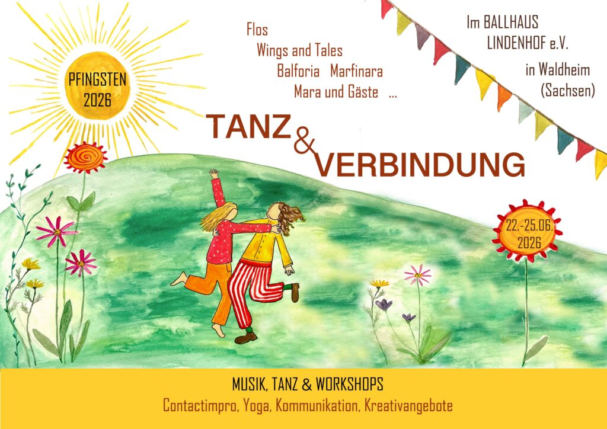

Zu Pfingsten lassen wir im und um das Ballhaus Lindenhof ein Wochenende voller Gemeinschaft, Kreativität und Lebendigkeit entstehen.
Diverse Workshops im Bereich Musik, Tanzen, Contactimpro, Yoga, Kommunikation und Kreativangebote laden ein, sich zu Spüren und miteinander in Kontakt zu kommen. Das Angebot entsteht durch die Teilnehmenden des Wochenendes, die sich mit ihren verschiedenen Qualitäten einbringen.
Willkommen sind dabei Menschen jeglichen Alters – sehr gern in der ganzen Familie, jeglicher Hautfarbe, Herkunft, Glaubensrichtung, Geschlechtsidentität oder sexueller Orientierung.
Du darfst hier so sein, wie du bist. Gewalt und berauschende Drogen haben hier allerdings keinen Platz.
Wir wünschen uns ein friedvolles, unterstützendes Miteinander, wo jede:r auf den anderen Menschen achtet und sie/ihn in seiner/ihrer Einzigartigkeit respektiert.

## Bands

### Freitag 22.05.

[split]
[col]
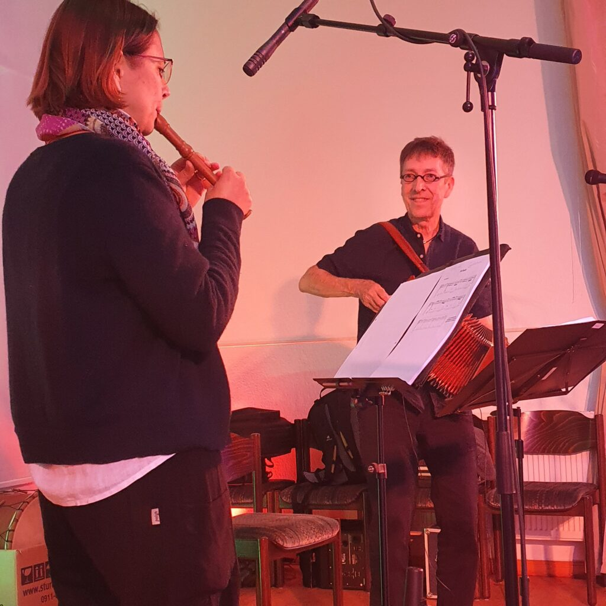
[/col]
[col]
#### Duo Bothe (D) – 19:00 Uhr

Andreas und Barbara Bothe aus Erlangen kommen mit Akkordeon, Harfe, Flöte und Klarinette und bringen uns zum Tanzen.
Andreas kennen einige von euch schon vom Duo Bothe/Molzahn oder von anderen Gelegenheiten. Nun neu als Duo auf den Bühnen des Balfolk.

*Andreas Bothe – diat. Akkordeon, Trommel*
*Barbara Bothe – Harfe, Flöte, Klarinette*
[/col]
[/split]

[split]
[col]
#### Snaarmaarwaar (BE) – 21:30 Uhr

Eine Gitarre, eine Mandola, eine Mandoline, ein Satz Ersatzsaiten und die immense Freude am gemeinsamen Musizieren: Mehr braucht es nicht, um das Publikum mit ihren inspirierenden Melodien und ihrer magischen Live-Atmosphäre zu begeistern. Ihr neues Album heißt „LYS" und erzählt die Geschichte der launischen und wunderschönen Wege, die sie mit ihrer Musik beschritten haben – genau wie der gleichnamige Fluss, der manchmal reißend, manchmal mäandernd zwischen Frankreich und Belgien fließt.

[Website](https://www.snaarmaarwaar.be/en/home/)
[/col]
[col]
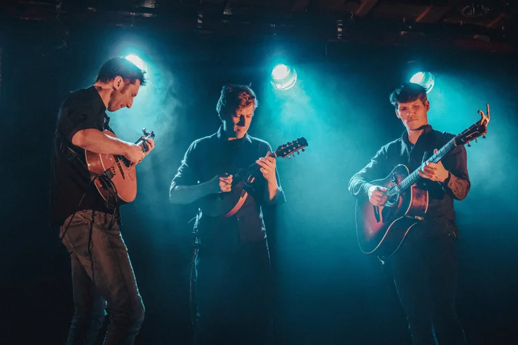
[/col]
[/split]

### Samstag 23.05.

[split]
[col]
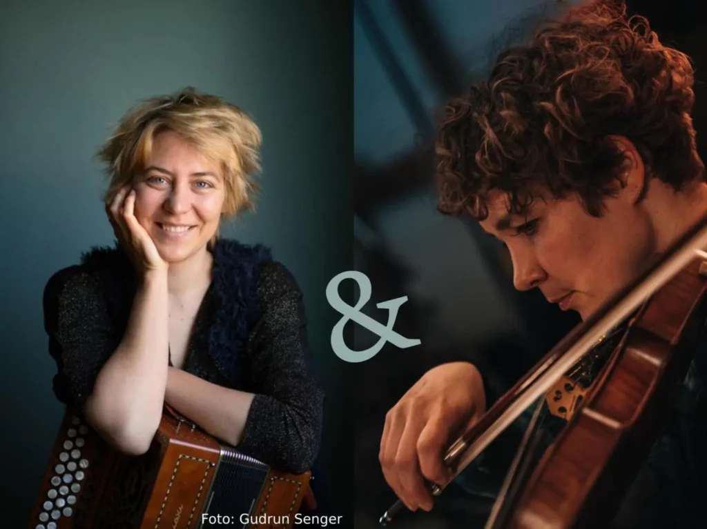
[/col]
[col]
#### Duo Marfinara (L) – 18:00 Uhr

Mara Menzel (Akkordeon) und Josefine Schlät (Geige) fließen als „Duo Marfinara" zusammen zu einer Einheit von Klang, Tanz, Glück.
In ihrem Spiel zeigt sich ihre ganze tänzerische Erfahrung mit viel Leichtigkeit und Gefühl. Wenn sie dann noch dazu singen, wird es besonders schön. Die Stücke sind abwechslungsreich – vom energetisch schwungvollen Schottisch oder Cercle bis zur romantisch melancholischen Mazurka ist alles dabei. Dabei bewegt sich die Musik, entwickelt sich und gibt immer wieder neue tänzerische Impulse.

*Mara Menzel – diat. Akkordeon, Gesang*
*Josefine Schlät – Geige*

[Website](http://queeringbalfolk.de)
[/col]
[/split]

#### Wings & Tales

[split]
[col]
Natur, Mehrklang, Tanzparty und Liebe. Unser Balfolk ist eine Reise zu lebenfrohen Melodien, stampfenden Rhythmen, einfühlsamen Texten und dem Zauber der Natur.

*Fili – Geige, Vocals, Obertongesang*
*Martin – Rhythmusgitarre, Vocals, Rahmentrommel*
*Niklas – Kontrabass, Vocals*
*Helena – Flöte, Vocals*

[Website](https://www.wingsandtales.de/)
[/col]
[col]
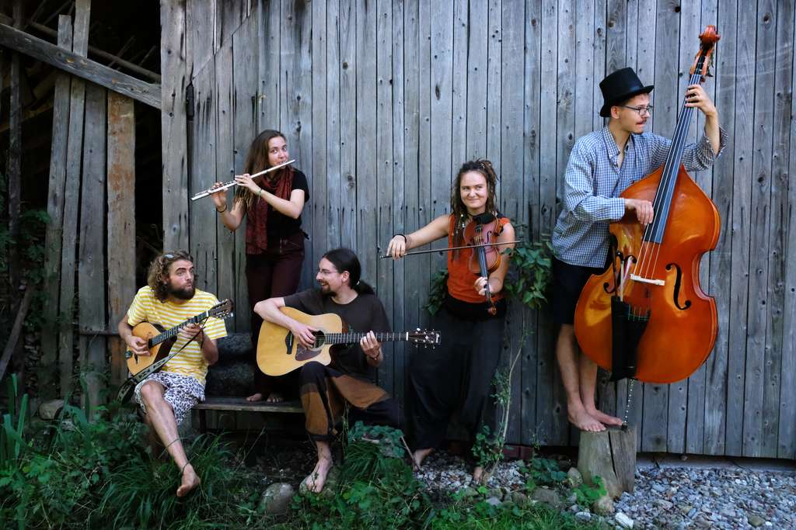
[/col]
[/split]

[split]
[col]
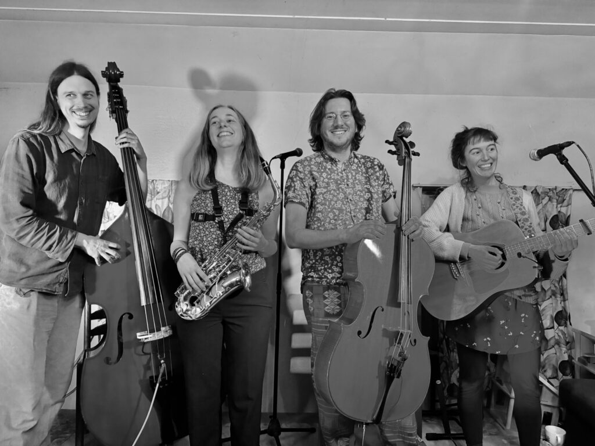
[/col]
[col]
#### Flos (NL)

Flos wurde in den Bergen gegründet und verwebt die Klänge der 4 Instrumente der Band. Mit eigenen Kompositionen und bestehenden Melodien lassen sie ihre Vorliebe für die Balfolkmusik ineinanderfließen. Schlendern Sie mit uns am Fluss entlang, wo die Maiglöckchen blühen und die Insekten tanzend den Frühling ankündigen.

*Yvette – Gitarre*
*Kris – Kontrabass*
*Lennaert – Cello*
*Renske – Saxophon*

[Facebook](https://www.facebook.com/flos.band)
[/col]
[/split]

### Sonntag 24.05.

[split]
[col]
#### Juggling Strings (DD und so) – 18:00 Uhr

Die Dresdner Band gründete sich aus dem Wunsch heraus, die Musik und Tanzfreude auf die Straße zu bringen und neue Menschen für wirbelnde Begegnung und den Folktanz zu begeistern.
Zwischen vielen Kreis- und Mixertänzen versteckt sich auch der eine oder andere historische Tanz oder Paartanz. Das Repertoire hierfür stammt aus dem europäischen Raum, von baskisch bis griechisch und italienisch bis dänisch…
Einige Tunes wurden bearbeitet oder gar neu interpretiert und oft wird auch fröhlich improvisiert.

*Arlett Grygar – Gesang, Kontrabass*
*Filine Ulrich – Gesang, Geige*
*Cora Schütze – Gesang, Bratsche*
*Robin Vollhardt – Gesang, Mandriola*
*Miroslav Mütze – Gesang, Bodhran*
[/col]
[col]
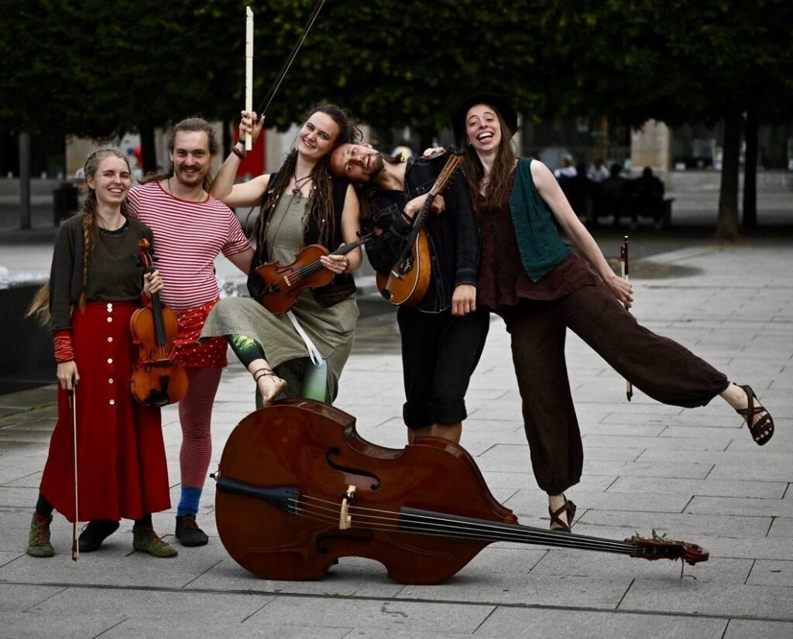
[/col]
[/split]

[split]
[col]
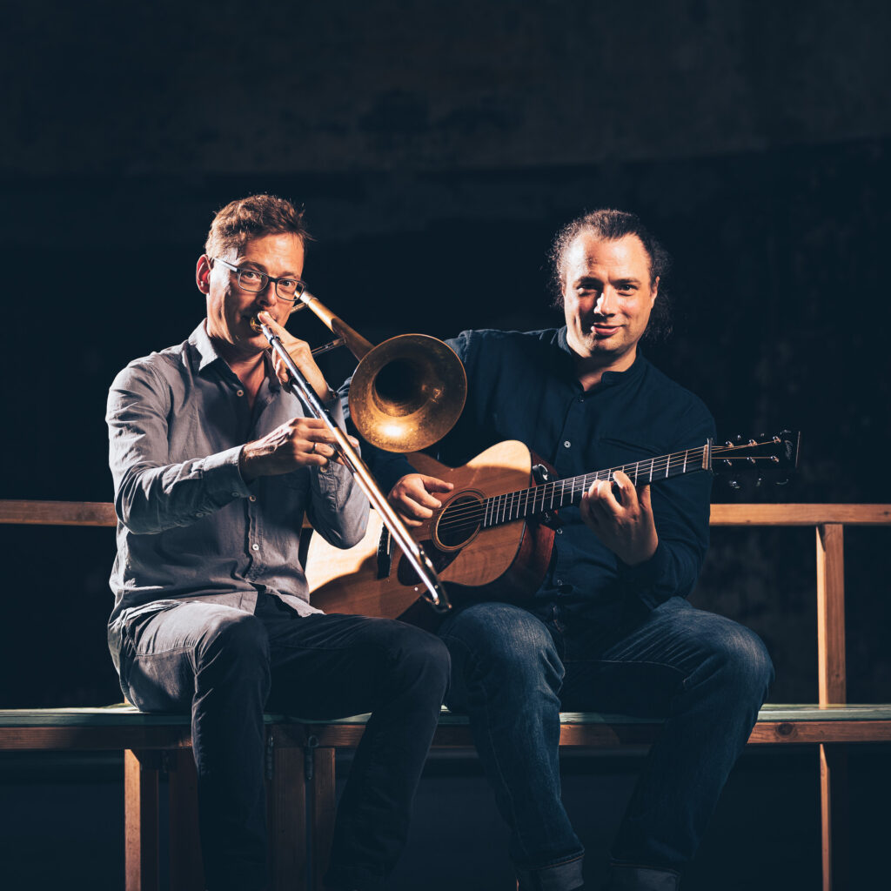
[/col]
[col]
#### Mehr als Wir (D) – 20:00 Uhr

Weniger Singer, mehr Songwriter.
Weniger Duo, mehr Band.
Weniger ist mehr.
**Mehr als Wir.**

Ihre Musik verbindet Folk mit Jazz, Pop mit World Music, rockige Elemente mit elektronischen Texturen – organisch, detailverliebt und stets überraschend. Live wird daraus ein virtuoses und unterhaltsames Konzerterlebnis, bei dem die beiden Musiker mit persönlichen und humorvollen Geschichten Einblicke in die Entstehung ihrer Songs geben. Instrumentaler Singer/Songwriter-Pop? Wenn es ihn gibt, dann so.

Groovy und gefühlvoll, witzig und melancholisch, leichtfüßig und mitreißend:
Die Songs von Mehr als Wir funktionieren auch ohne Worte – und bleiben lange nach dem letzten Ton im Kopf.

Ein Konzert zum Lauschen mit Raum für freie Tanzimprovisationen.

*Matthias Ehrig – Gitarre, Loopstation und Stompbox*
*Andreas Uhlmann – Posaune, Flügelhorn, Synthesizer, Loopstation und Beatbox*

[Website](https://mehralswir.de/)
[/col]
[/split]

[Balforia](https://balforia.com/) können leider aus persönlichen Gründen nicht in Waldheim spielen

#### Wings & Tales

[split]
[col]
Natur, Mehrklang, Tanzparty und Liebe. Unser Balfolk ist eine Reise zu lebenfrohen Melodien, stampfenden Rhythmen, einfühlsamen Texten und dem Zauber der Natur.

*Fili – Geige, Vocals, Obertongesang*
*Martin – Rhythmusgitarre, Vocals, Rahmentrommel*
*Niklas – Kontrabass, Vocals*
*Helena – Flöte, Vocals*

[Website](https://www.wingsandtales.de/)
[/col]
[col]

[/col]
[/split]

### Montag, 25.05.

[split]
[col]
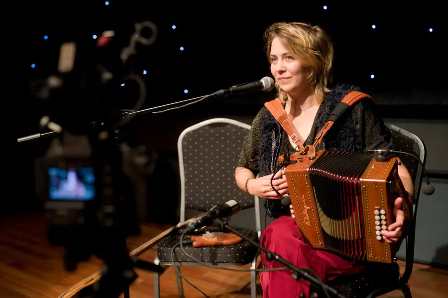
[/col]
[col]
#### Mara Menzel und friends (L) – 12:00 Uhr

Ein Akkordeon, eine Stimme und selbstgeschriebene Melodien.

Mara Menzel spielt seit sie zum 18. Geburtstag ein diatonisches Akkordeon geschenkt bekam mit Bands wie „Stimmt so.", „Searching the Roots", „Lunesk" oder „Knopfgemurmel" zuerst auf Bühnen in Deutschland und dann in Europa. Mit der Zeit sind viele Melodien zu Balfolk-Stücken geworden, sodass sie seit einigen Jahren nun auch mit ihrem Soloset auftritt. In ihren Stücken stecken Geschichten, Lebensfreude und viel Gefühl. Selbst vom Tanz kommend, kombiniert sie ihren Spaß mit der Erfahrung als Musikerin und Tänzerin. Ihr könnt euch bei ihrem Solo-Konzert auf mehrsprachigen Gesang, viel Spaß, und eine offene und warme Atmosphäre freuen.

[Website](https://queeringbalfolk.de/mara/mara-menzel-musik/)
[/col]
[/split]

## Workshops

### Freitag 22.05.

#### Willkommensworkshop – 17:30 Uhr

### Samstag 23.05.

#### Reise an deinen inneren Kraftort – Kristina – 9:00 Uhr (Sofaraum)

Komm ganz in dir selbst an und lernen einen sicheren Ort in dir kennen, an den du immer wieder gehen kannst, wenn du eine Auszeit für dich brauchst. Ein wunderbarer Start in den Tag.

#### Spür dich in deinem Körper – Frieda – 11:00 Uhr (Balkonsaal)

Komm in deinem Körper an. Atme dich. Richte dich auf. In Leichtigkeit.

#### Tanzeinführungsworkshop – Jana und Edgar – 12:00 Uhr (Saal)

Ein Einführungskurs in verschiedene Balfolktänze (für Anfänger), der kurz und knapp euch die Gelegenheit gibt, mit den Grundformen gleich in verschiedene Paar – Kreis- und Reihentänze einzusteigen.

#### Acroyoga – Louise und Aaron – 12:00 Uhr (Wiese)

#### Tune learning session – Tomas Fiers – 12:00 Uhr (Anticafé)

for musicians: learn a tune to play together

#### Scottisch deep dive – Frank Jagusch – 14:00 Uhr

#### Uvos = Unvollendete Näh/Strickprojekte vollenden – Anke W. – 14:00 Uhr (Kreativraum)

Reparatur an Kleidung im Alltag per Hand

#### Pfadfinderlieder singen – Arlett und Tux – 17:00 Uhr (Pavillon)

### Sonntag 24.05.

#### Daumen-Hirn-Yoga – Marina – 12:00 Uhr (Balkonsaal)

#### Theaterübungen zur französischen Aussprache – Harald – 12:00 Uhr (Kreativraum)

Übungen für typische Laute der französischen Sprache. Sie klingt romantisch, manche Laute fühlen sich bei der Erzeugung lächerlich an. Wir nähern uns diesen Lauten spielerisch.
Keine französischen Sprachkenntnisse nötig.

#### Malen mit den Füßen – Anne – 14:00 Uhr (Balkonsaal)

Tanzen sichtbar machen: Durch Schritte entstehen mit den Füßen farbige Spuren auf einer Leinwand. Wir experimentieren Bewegung in Farbe darzustellen und entdecken, wie Tanz kreative Bilder entstehen lassen kann.
Vorsicht: Dabei werden die Füße dreckig!

### Montag, 25.05.

#### Branles und Kreistänze – Marlies – 10:30 Uhr (Balkonsaal)

Du hast Lust, einen Workshop zu geben? Dann schick eine Workshopbeschreibung und mögliche Zeiten an tuv@dckn.de

## Veranstaltungsort

[split]
[col]
Wir tanzen im imposanten Grünen Ballsaal im [Ballhaus Lindenhof](https://gruenesballhaus.jimdofree.com/gr%C3%BCner-ballsaal/) in Waldheim, mitten in Sachsen.
Waldheim ist ungefähr im Mittelpunkt zwischen Leipzig, Dresden, Chemnitz.

**Lindenhof**
Mittweidaer Str. 5A
04736 WALDHEIM

Vom Bahnhof sind es 1,2 km zum Ballhaus.
Die Parkplätze am Haus sind als Übernachtungsplätze reserviert, weitere sind nur entlang der Straße zu finden oder im Zentrum gibt es noch Stellflächen.
[/col]
[col]
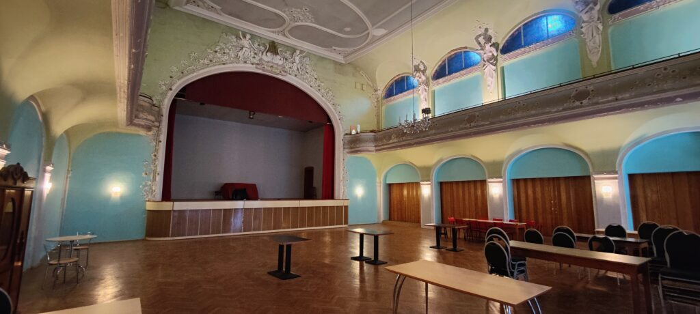
[/col]
[/split]

## Essen

[split]
[col]

[/col]
[col]
Freitag Abend gestalten wir ein gemeinsames Mitbringbuffet ab 17:30.
Es gibt eine Küche, in der sich Küchenteams um die gemeinsamen Mahlzeiten kümmern werden.
Frühstück jeweils 9 – 12 Uhr
1 warme Mahlzeit ca 16:30 – 18:30 Uhr
Mitternachtssnack Fr, Sa und So
[/col]
[/split]

## Schlafen

[split]
[col]
Nach dem Tanzen braucht es die Möglichkeit zum Ausruhen.
Es gibt direkt im Lindenhof einige Zimmer zum Übernachten (3-6 Personen, mit Dusche/WC).
Außerdem ist es möglich, auf der Wiese zu zelten oder im Hof im Auto zu schlafen.
Für die Zelter und "Autoschläfer" werden Außenduschen installiert.

Im Zentrum von Waldheim befindet sich in 15 Minuten fußläufiger Entfernung das Hotel Goldener Löwe.
[/col]
[col]
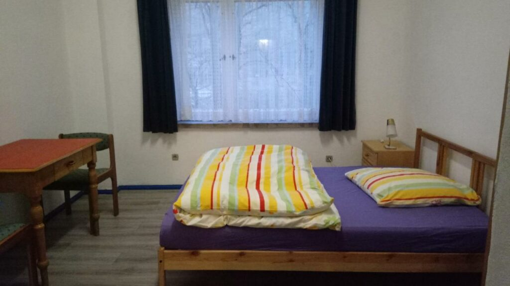
[/col]
[/split]

## Kleidertausch/Verschenketisch

Ihr könnt ein paar Kleidungsstücke mitbringen, die nicht mehr getragen werden, aber in gutem Zustand für neue Besitzer sind und sucht euch etwas aus von den vorhandenen Dingen. Kleidungsstücke für Menschen jeden Alters, Schuhe, CDs, Bücher. Es ist auch möglich, nur zu finden.
Was übrig bleibt, geht an Unterstützungsprojekte für Menschen, denen es weniger gut geht im Leben.

## Co-Kreation

wie ihr sie vom SimmelFolk Festival und MärzTanz Festival schon kennt:
Dieses Festival ist ein **Gemeinschaftsprojekt**.
Es lebt mit euch, durch euch, von euch.
Ohne euch gibt es kein **Tanz und Verbindung** Wochenende.

Jede:r ist eingeladen sich mit ihren/seinen Fähigkeiten, Energie und Präsenz einzubringen, um das Festival mitzugestalten, egal ob als Musiker:in oder Workshopleiter:in, beim Kochen, vorbereiten oder aufräumen.
Jede:r Teilnehmende trägt ein oder zwei kleine "Ämtli", so erschaffen wir das **Tanz und Verbindung** Wochenende – das ist Co-Kreation.

Meldet euch gern, wenn ihr euch in der Organisation im Vorfeld oder direkt vor Ort mit eigenen Ideen und tatkräftigen Händen einbringen wollt.

## Festivalkarten

In dem Teilnahmebeitrag ist alles inklusive: 3,5 Tage Festival, alle Bälle, Verpflegung, Workshops.
Jede:r wird ein Ämtli übernehmen um zum Gelingen des Festivals beizutragen.
Wenn es dir möglich ist, etwas mehr zu geben, darst du gern zum Ticket eine Spende ergänzen und dazu beitragen, dass das Festival ein voller Erfolg wird.

### Storno

Wenn das Festival aus Gründen höherer Gewalt abgesagt werden müsste, werden die Kosten erstattet.
Im Falle, dass ihr doch nicht teilnehmen könnt, ist eine Erstattung ausgeschlossen. Ihr könnt das Ticket einer anderen Person weitergeben.

## Code of Conduct

Willkommen sind hier Menschen jeglichen Alters – sehr gern in der ganzen Familie, jeglicher Hautfarbe, Herkunft, Glaubensrichtung, Geschlechtsidentität oder sexueller Orientierung.
Du darfst hier so sein, wie du bist. Gewalt und berauschende Drogen haben hier allerdings keinen Platz.
Wir wünschen uns ein friedvolles, unterstützendes Miteinander, wo jede:r auf den anderen Menschen achtet und sie/ihn in seiner/ihrer Einzigartigkeit respektiert.

Beim Tanzen geht es um die Gemeinschaft, nicht um Perfektion. "Dance roles are social constructs." = Tanze in der Rolle, die du möchtest. Du darfst jeden Menschen (egal welchen Alters, Geschlechts, …) zum Tanz bitten und jeder darf die Bitte frei beantworten. Solltest du ein Nein erhalten, betrachte es mit Dankbarkeit. Du hast in dem Moment ein Ja des anderen Menschen zu den eigenen Bedürfnissen erhalten.
Im Tanzsaal ist während des Balls Zeit der Musik zu lauschen und dazu zu tanzen. Für Gespräche gibt es in anderen Räumen und in den Pausen Gelegenheit.
Bitte achtet bei euren Tänzen auch auf eure Umgebung. Manchmal ist nicht genug Platz für sehr ausladende Figuren, dann spart sie euch bitte für Momente mit mehr Platz auf. Wenn ihr euch in eine Kette einreihen wollt, dann bitte am Ende anhängen. In Kreisen im besten Fall schon mit dem aufgenommenen Rhythmus und zu einem günstigen Zeitpunkt einsteigen, um die anderen nicht aus dem Takt zu bringen. Nicht alle tanzen schon seit Jahren und sind in den Tänzen sicher.
Bei Paartänzen, die sich im Raum bewegen, sind die Tänzer, die am Platz tanzen in der Mitte und die Tänzer, die in Tanzrichtung durch den Raum tanzen, außen.
Bist du neu im Balfolk, wird es die Möglichkeit geben, mit einem Erkennungszeichen darauf aufmerksam zu machen, dass du den Wunsch hast, von erfahrenen Tänzer:innen an die Hand genommen zu werden.

Bitte geh achtsam mit den Räumen und allen Gegenständen um. Fällt dir etwas auf, was nicht in Ordnung ist oder sollte dir versehentlich etwas kaputt gegangen sein, wäre es schön, wenn du dafür Sorge trägst, dass es in Ordnung kommt oder eine Info an das Orgateam weiterreichst.
Beim Tanz-Wochenende werden Fotos und Videos erstellt und den Teilnehmern zugänglich gemacht. Manche der Daten werden auch öffentlich verwendet. Mit deiner Teilnahme erklärst du dich damit einverstanden. Falls du nicht einverstanden bist, muss die Einwilligung schriftlich bei DCKN e.V. widerrufen werden.

Auf ein schönes gemeinsames Tanzfest!
