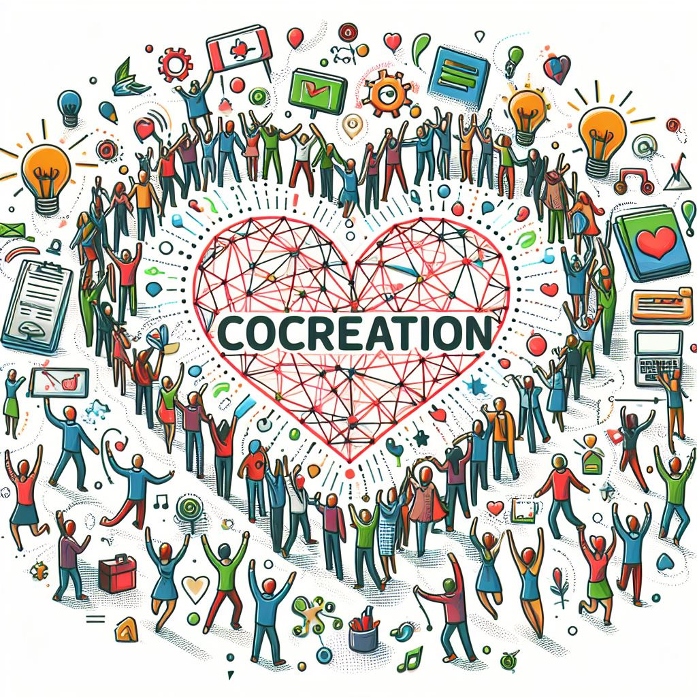
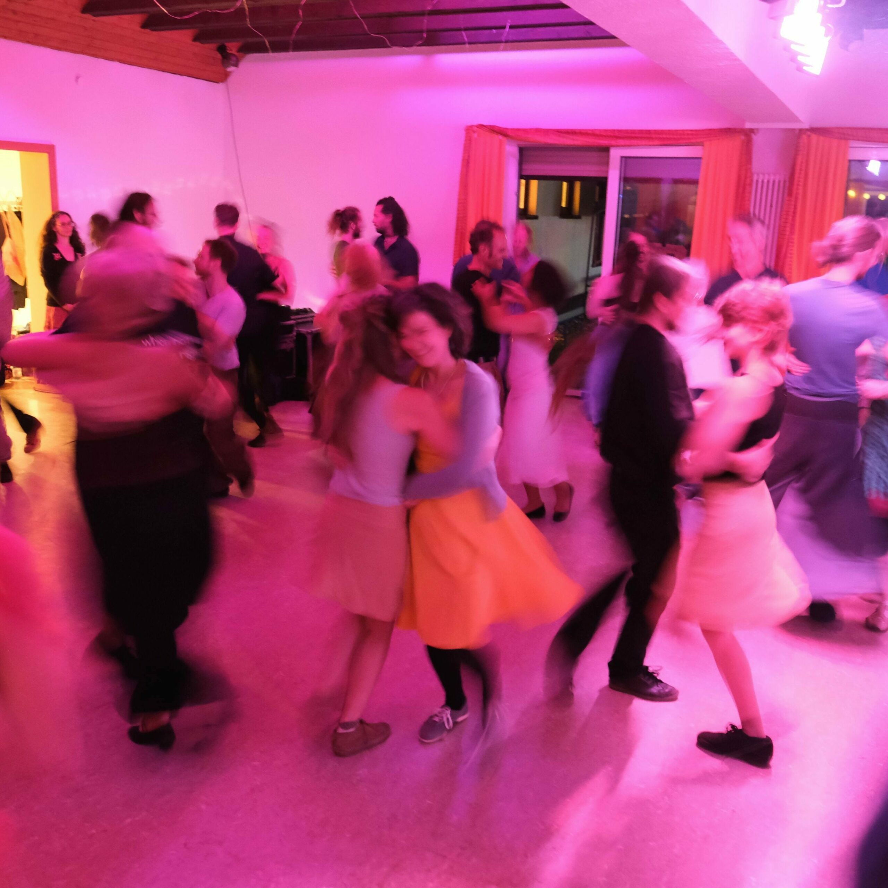

# Der Verein

Das co-kreative Netzwerk wurde 2023 gegründet mit dem Ziel co-kreative Projekte zu fördern. Ein co-kreatives Projekt erfordert das Zusammenwirken mehrerer Personen über einen gewissen Zeitraum zur Förderung oder Verwirklichung eines gemeinsamen Zweckes, im Folgenden „Beitrag" genannt.

## Was wir bieten

## Unsere Werte für co-kreative Projekte

### Co-Kreation

Personen, die den Zweck des jeweiligen co-kreativen Projektes durch ihre Leistungen fördern (im Folgenden „Beitragende"), sollen sich gegenseitig durch ihre Fähigkeiten, Erfahrungen, Ideen und / oder ihr Wissen bereichern. Durch interdisziplinäre Zusammenarbeit und/ oder wenn Beitragende für ein gemeinsames Ziel ihre unterschiedlichen Fähigkeiten bündeln, entsteht ein gemeinsamer Schöpfungsprozess, bei dem sich die individuellen Stärken gegenseitig multiplizieren.

### Eigenverantwortung

Beiträge sind in der Regel unentgeltliche Leistungen mit dem maßgeblichen Zweck, die Gemeinschaft zu bereichern. Jede:r Beitragende ist für sich und seine/ihre eigenen Bedürfnisse in dem Sinne verantwortlich, dass er/sie nur solche Beiträge verspricht und erbringt, die er/sie innerhalb seiner/ihrer körperlichen und mentalen Fähigkeiten erbringen kann. Durch eine derartige Übernahme von Verantwortung für die eigenen Bedürfnisse trägt jede/r Beitragende zum Gemeinwohl bei.

### Gerechtigkeit und Gleichberechtigung

Alle Beitragenden begegnen sich mit Menschlichkeit und auf Augenhöhe, Missstände oder Ungerechtigkeit werden bewusst gemacht, um sie zu verbessern. Es wird niemand benachteiligt oder bevorzugt, von einem co-kreativen Projekt profitieren alle Beteiligten.

### Respekt und Freundlichkeit

Alle Beitragenden respektieren einander als Menschen, mit individuellen Bedürfnissen und Grenzen. Die unvoreingenommene Begegnung, eine offene Kommunikation und ein wertschätzender Umgang miteinander sind die Basis jeder Interaktion. Aus dieser Grundhaltung wächst das Vertrauen, in dem alle Beitragenden ihr einzigartiges authentisches Selbst zeigen können und aufrichtige, zwischenmenschliche Nähe entstehen kann.

## Weitere Förderkriterien co-kreativer Projekte

### Transparenz

Der Umgang mit Ressourcen (monetär, materiell und immateriell) ist bei allen Projekten transparent, offen und nachvollziehbar darzulegen. Es wird ein wertschöpfender, verantwortungsvoller und nachhaltiger Umgang mit allen Ressourcen angestrebt. Alle Beitragenden sollen von den Beiträgen profitieren können.

### Gemeinschaft

Alle Menschen, die sich in ein co-kreatives Projekt einbringen möchten, sind willkommen, unabhängig von Alter, Herkunft, Geschlecht, politischer, religiöser / spiritueller, kultureller oder ethnischer Gesinnung. Über das co-kreative Projekt hinaus wird die Schaffung und Erhaltung eines co-kreativen Netzwerkes angestrebt. Das Co-Kreative Netzwerk ist ein neutraler Raum, in dem Gemeinschaft gelebt und erfahren werden kann und die Freude am Gelingen sowie an gemeinschaftlich getragener Verantwortung von co-kreativen Projekten miteinander geteilt wird. Dem zu Grunde liegt die südafrikanische Lebensphilosophie Ubuntu.

> Das Wort Ubuntu kommt aus den [Bantusprachen](https://de.wikipedia.org/wiki/Bantusprachen) der [Zulu](https://de.wikipedia.org/wiki/Zulu_\(Volk\)) und der [Xhosa](https://de.wikipedia.org/wiki/Xhosa_\(Volk\)) und bedeutet in etwa „[Menschlichkeit](https://de.wikipedia.org/wiki/Menschlichkeit)", „[Nächstenliebe](https://de.wikipedia.org/wiki/N%C3%A4chstenliebe)" und „[Gemeinsinn](https://de.wikipedia.org/wiki/Gemeinsinn_\(Gemeinwohl\))" sowie die Erfahrung und das Bewusstsein, dass man selbst Teil eines Ganzen ist.
>
> Damit wird eine Grundhaltung bezeichnet, die sich vor allem auf wechselseitigen [Respekt](https://de.wikipedia.org/wiki/Respekt) und [Anerkennung](https://de.wikipedia.org/wiki/Anerkennung), Achtung der [Menschenwürde](https://de.wikipedia.org/wiki/Menschenw%C3%BCrde) und das Bestreben nach einer [harmonischen](https://de.wikipedia.org/wiki/Harmonie) und friedlichen Gesellschaft stützt, aber auch auf den Glauben an ein „universelles Band des Teilens, das alles Menschliche verbindet". Die eigene Persönlichkeit und die Gemeinschaft stehen in der Ubuntu-Philosophie in enger Beziehung zueinander.
>
> [https://de.wikipedia.org/wiki/Ubuntu\_(Philosophie)](https://de.wikipedia.org/wiki/Ubuntu_\(Philosophie\))

### Toleranz

Die Erfahrungen, die Beitragende im Rahmen eines co-kreativen Projektes machen, sollen sie für das aktive Hinterfragen von Vorurteilen, Konkurrenzdenken und unbewussten Bewertungen sensibilisieren sowie Neugierde und Interesse an anderen Menschen und Perspektiven fördern.

### Nicht-Kommerzialität

Co-kreative Projekte sind nicht auf die Erwirtschaftung von Gewinn ausgelegt. Sie verbinden Gleichgesinnte miteinander, um die Haltung von Co-Kreation zu üben.
