## 6. SimmelFolk Festival vom 03.-06. September 2026

[Anmeldung](https://eveeno.com/simmelfolk)

### Ihr lieben Balfolk-Menschen!

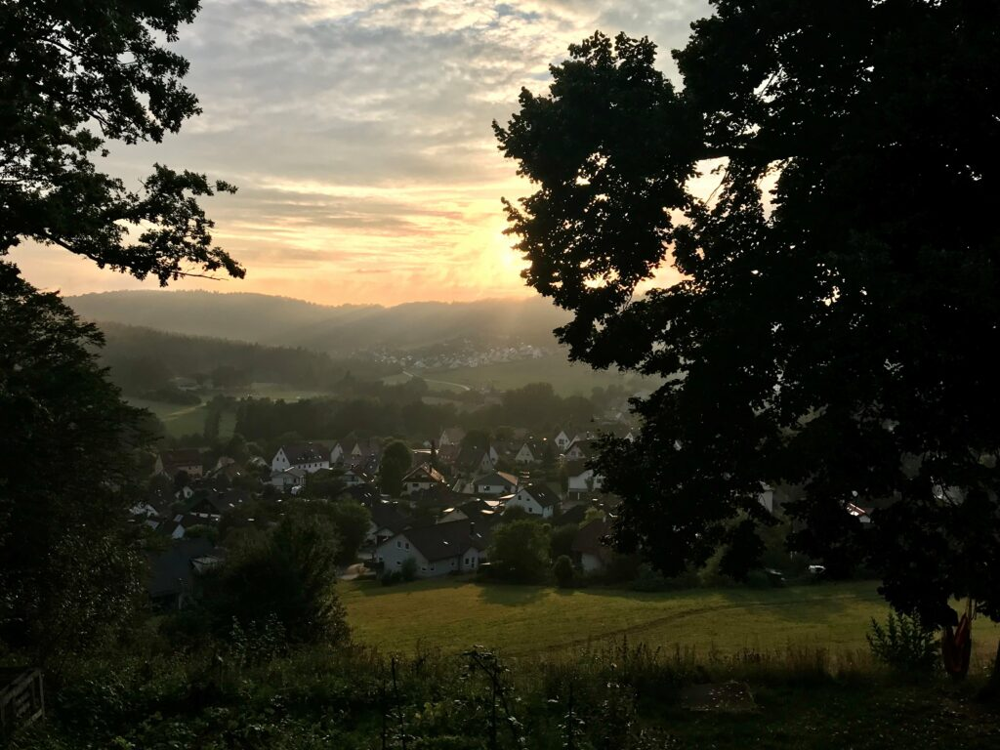

Wir laden euch herzlich zum SimmelFolk Festivals ein, ein Balfolk-Wochenende voller Tanz und Musik in wundervoller Umgebung und entspannter Atmosphäre.

Gemeinsam schaffen wir einen Ort der Gemeinschaft, mit gegenseitigem Respekt und ausgelassener Fröhlichkeit, mit freudigem Wiedersehen und neuen Begegnungen, geselligen Stunden am Lagerfeuer, beim jammen, chillen und gemeinsamem Essen, beim Reden, Lachen, Umarmen und vielem mehr.

Kommt und bringt eure Freunde mit!

### Mitmach-Festival

Dieses Festival ist ein Gemeinschaftsprojekt.
Es lebt mit euch, durch euch, von euch.
Ohne euch gibt es kein Festival.

Jede und jeder ist eingeladen sich mit ihren/seinen Fähigkeiten, Energie und Präsenz einzubringen, um das Festival mitzugestalten, egal ob als Musiker:in oder Workshopleiter:in, beim Kochen, Vorbereiten oder Aufräumen.
Alle Teilnehmenden tragen ein oder zwei kleine "Ämtli", so erschaffen wir ein Balfolk-Festival. Das ist Co-Kreation!

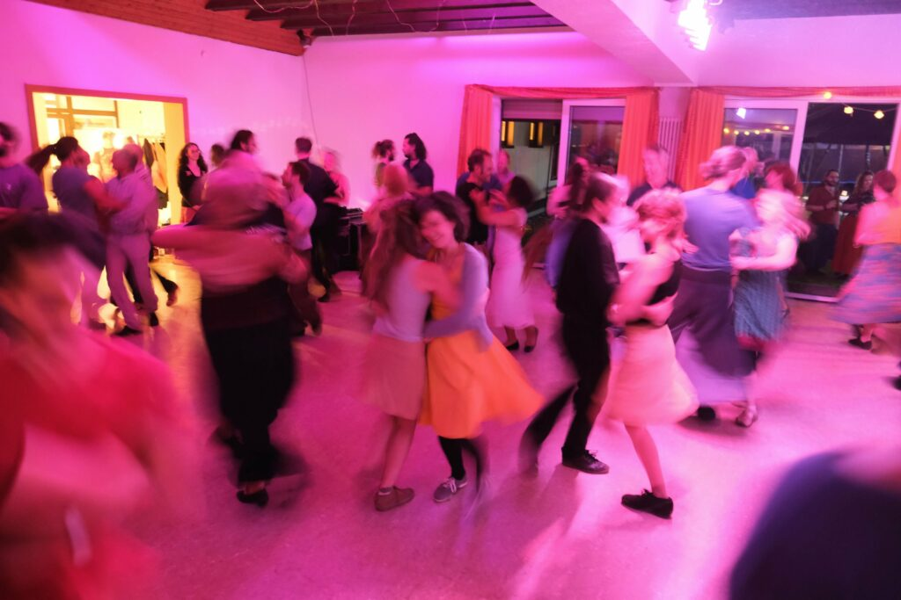

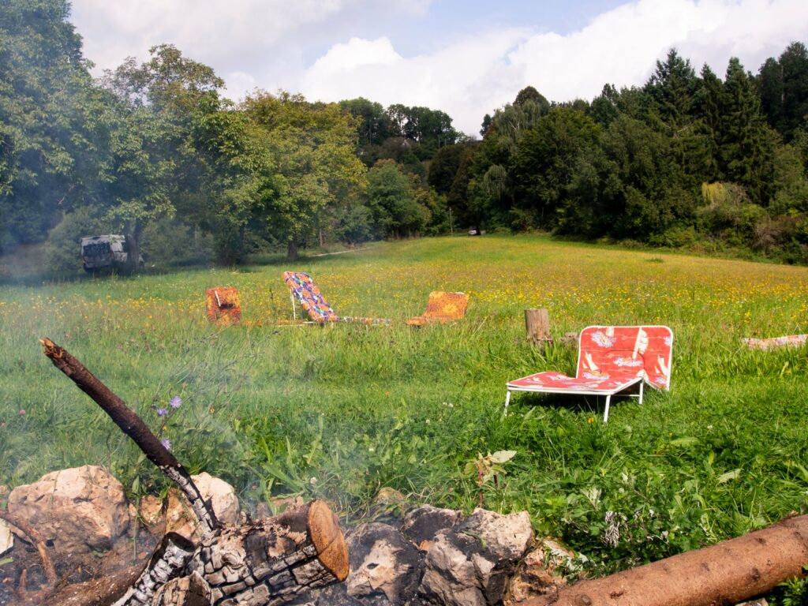

### Auf dem Bühl

Das Festival findet auf dem Bühl in Simmelsdorf statt, am Tor zur Fränkischen Schweiz.

Es ist der perfekte Ort für ein Festival: wenig Verkehr und Nachbarn aber viel Platz, grüne Hügel und umgeben von wunderschöner Natur.
Egal, ob ihr rund um die Uhr tanzen wollt, oder einfach in Ruhe ausspannen, der Spätsommer auf dem Bühl lädt euch ein, einfach nur hier zu sein.

Ihr seid herzlich willkommen mit uns die Musik, die Freundschaft und das Leben zu feiern!

[Anmeldung](https://eveeno.com/simmelfolk)

## Programm und Bands

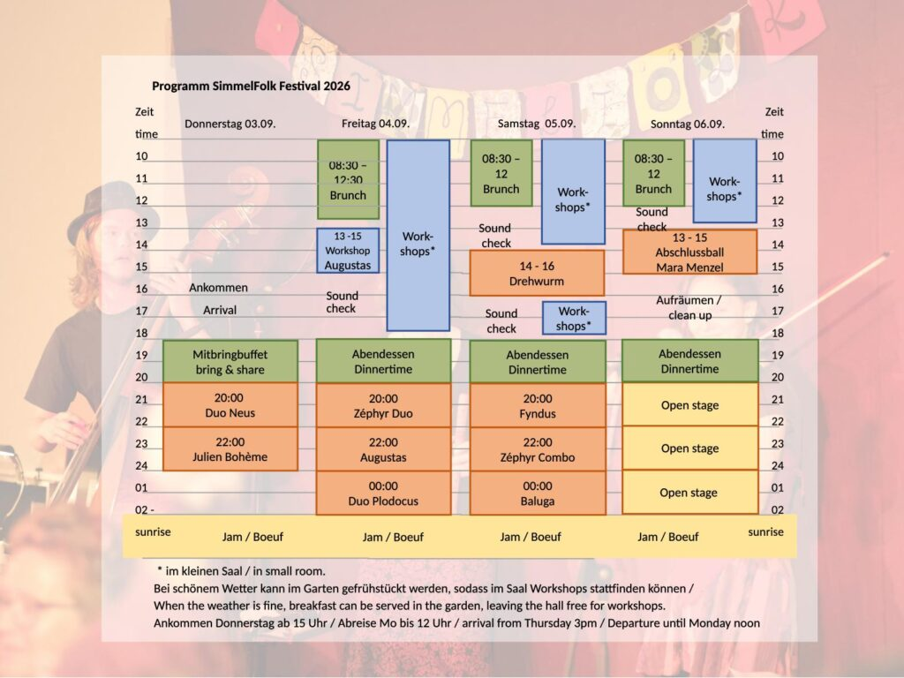

### Augustas (LT)

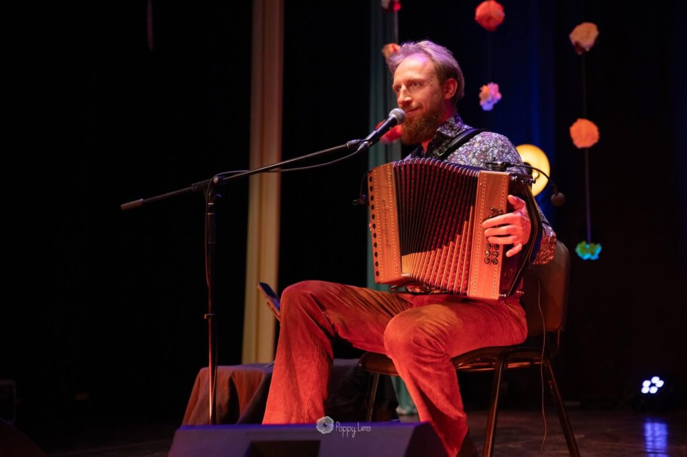

Hinter dem Projekt „Rhythmic Connections" steht ein Musiker aus Litauen, der traditionelle Tanzmelodien mit eigenen Balfolk-Kompositionen verbindet. Erste Bühnenerfahrungen sammelte er 2018, seitdem hat sich sein Stil stetig weiterentwickelt – nun ist er solo unterwegs.

Mit Auftritten in ganz Europa hat er sich einen Namen in der Balfolk-Szene gemacht. Seine Musik war bereits auf zahlreichen Tanzbällen und Festivals zu hören, von Litauen bis Spanien, von Bulgarien bis Portugal.

Seine Leidenschaft für Folk und Tanz ist in jedem Moment spürbar: Mitreißende Rhythmen, lebendige Improvisationen und ein vielseitiger Mix aus traditionellen Klängen und eigenen Stücken prägen seinen Sound. Ein Auftritt, der das Publikum bewegt – und garantiert niemanden lange stillstehen lässt.

*Augustas – chromatisches Akkordeon*

**Augustas wird am Freitag um 13h einen Workshop für uns geben – nicht verpassen!**

- [Spotify](https://open.spotify.com/artist/74EezmExdfRycjKq4m3LRc?si=nKLxrVo_S22HAh8S1Dvd4g)
- [Apple music](https://music.apple.com/lt/artist/augustas-%C4%8Derniauskas/1557583800)

### Baluga (F)

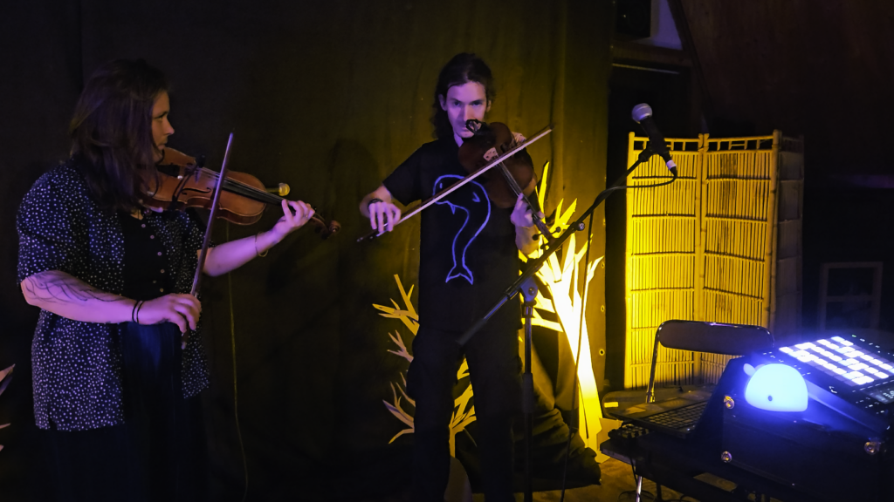

Eymeric's electro-folk Projekt…

Folge dem Belugawal …
hinter den Parkettdielen öffnet sich eine schimmernde blaue Welt: getragen von verträumten Synthesizerklängen, durchzogen von galoppierenden Streichern und umspielt von wirbelnden Trommelrhythmen – alles eingebettet in einen tiefen, geheimnisvoll leuchtenden Bassnebel.

*Eymeric Amselem – Geige und Synthesizer*
*Anaïs Wisniewski – Geige*

- [Youtube](https://www.youtube.com/watch?v=fmHlp4Vv4XU&feature=youtu.be)

### Duo Neus (D)

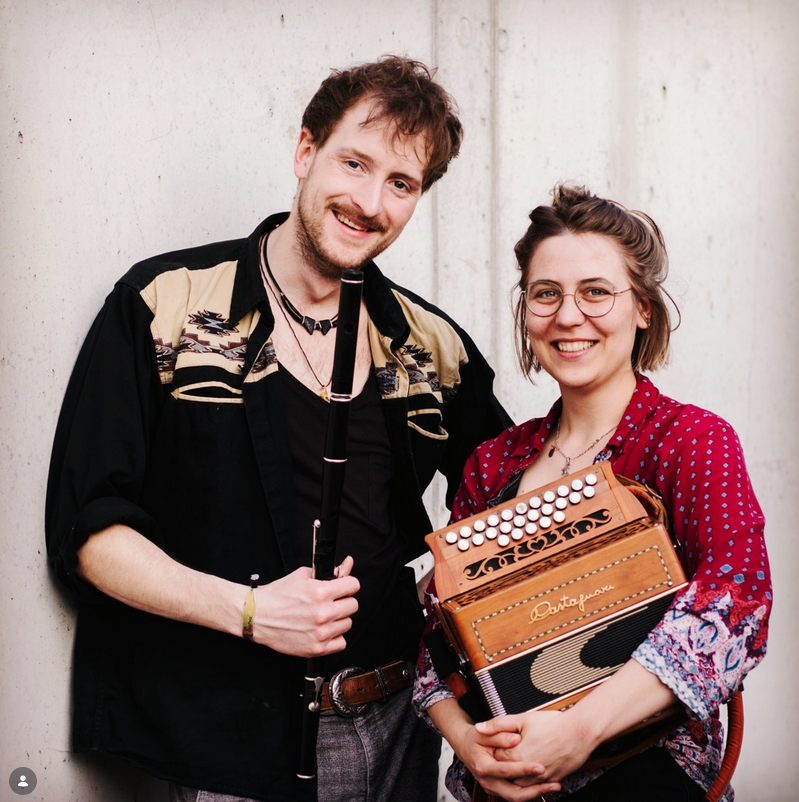

aka Mara und Torge haben im Frühling 2024 erstmals zusammen gespielt und es war sofort klar, dass es bei dieser Begegnung nicht bleiben konnte. In kürzester Zeit schrieben sie eine Menge Tunes und haben mittlerweile ein vielseitiges Konzertprogramm für einen vollen Balfolk Abend anzubieten.

Ihre Stücke kommen aus eigener Feder und sind allesamt neu. Duo Neus spielt sowohl zum Tanz als auch zum Zuhören – auf jeden Fall spielen sie mit viel Feuer und Spaß!

*Mara – diatonisches Akkordion, Stimme*
*Torge – allerlei Blasinstrumente*

- [Insta](https://www.instagram.com/duo_neus/)
- [Youtube](https://youtu.be/xxSuulhm6_w?si=G_FcOMj6L1e4dHt1)

### Duo Plodocus (F)

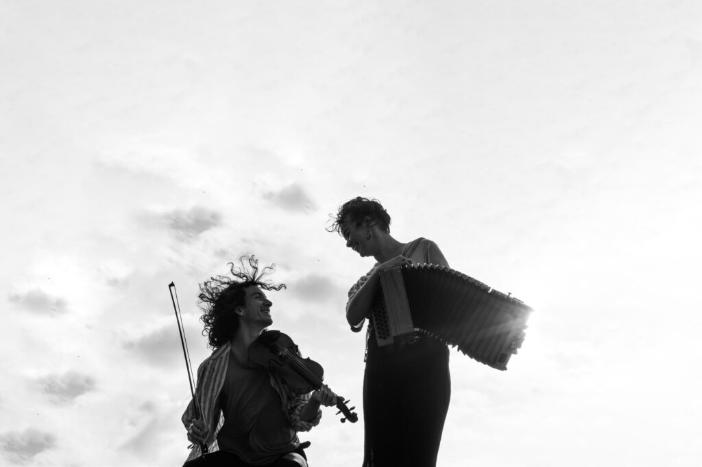

… lädt zu einer ebenso feinsinnigen wie verspielten musikalischen Reise ein. Mit Geige, diatonischem Akkordeon und Gesang verweben sie eigene Kompositionen und neu interpretierte traditionelle Melodien zu ihrem ganz eigenen Klang – der unverwechselbaren „Plodo-Sauce".

Ihre Musik durchstreift Klanglandschaften voller Farben und Kontraste und führt das Publikum mitten hinein in die Welt europäischer Tänze: von lebendigen Paartänzen über mitreißende Mixer bis hin zu bretonischen Rhythmen und Traditionen aus Poitou, der Auvergne und dem Südwesten Frankreichs.

Die Klänge atmen, flirren und überraschen – sie kribbeln im Nacken, tragen durch den Raum und finden ihren Puls im Rhythmus der Tanzschritte. Ein Konzert, das nicht nur gehört, sondern gespürt wird – und das unweigerlich Lust macht, sich von der Musik mitreißen zu lassen.

*Sidonie Couëdel – diatonisches Akkordeon, Stimme*
*Eymeric Amselem – Geige, Stimme*

- [Youtube](https://www.youtube.com/watch?v=zCi8lXrmp74&feature=youtu.be)
- [Youtube](https://www.youtube.com/watch?v=VesTs5017hQ)
- [Insta](https://www.instagram.com/duoplodocus/)

### Drehwurm (D)

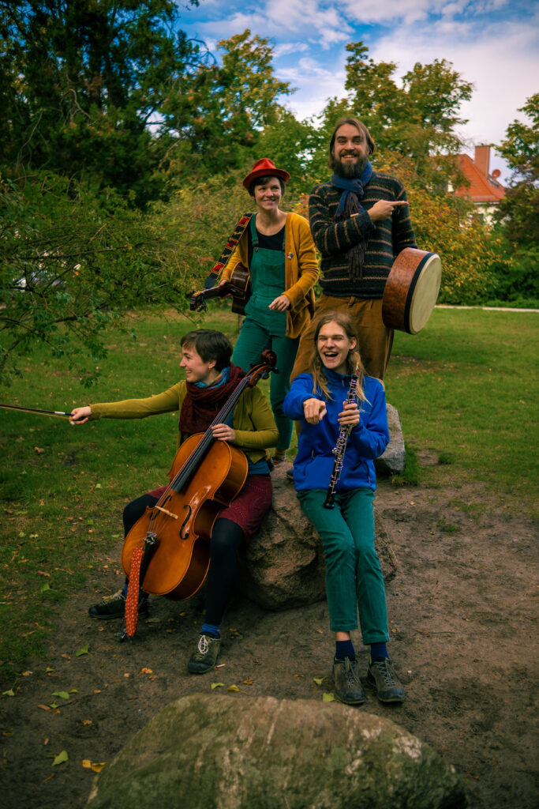

Wir sind Drehwurm aus Berlin, Lübeck und Erfurt. Uns verbindet nicht nur unsere Nähe zu Dresden, sondern besonders unsere Freude am gemeinsamen Musizieren.

Unsere Stücke sind selbstgeschrieben und vielschichtig, wie unsere Liebe zu Zwiebeln. Sie sind geprägt von internationaler Folkmusik (ägyptischen Trolltänzen, Metal,…) sowie von Liedermachern und Holter-die-polter-Polka. Diese Stilrichtungen finden sich in schwindelerregenden Walzern, träumerischen Gavottes, angriffslustigen Bourrees und flott geflöteten Polkas wieder. Dazu gibt es eigene Texte, inhaltlich gestreut von philosophischen Themen über Landschaftsbeschreibungen bis hin zu Gutenachtliedern. Mit einer Prise Albernheit gestalten wir unsere Musik sowohl tanzbar als auch zum lauschen.

*Hannah – Cello, Stimme*
*Max – Oboe*
*Nico – Gitarre, Bouzouki*
*Teresa – Gitarre, Stimme, Flöten*

- [Homepage](https://drehwurm.band/)

### Fyndus (B)

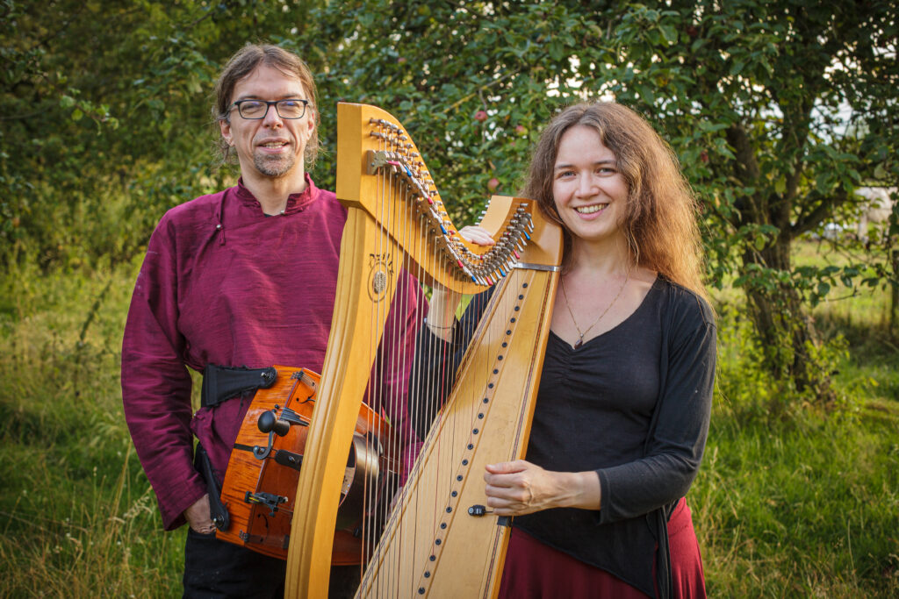

Willkommen in der wunderbaren Welt von Fyndus, einem neuen Folk-Duo mit Emma Coopman und Thomas Hoste (elektroakustische Alt-Drehleier & Soundeffekte).
Gemeinsam präsentieren wir sehr tanzbare Musik zum Zuhören oder hörenswerte Tanzmusik.
Genießt unsere musikalischen Geschichten und lasst euch von der magischen Harmonie unserer Instrumente verzaubern. Im Februar 2025 haben wir unsere erste CD „re root ed" veröffentlicht.

Wir haben unsere Musik bereits auf vielen (inter)nationalen Bühnen präsentiert.

*Emma Coopman – Gesang, keltische Harfe & diatonisches Akkordeon*
*Thomas Hoste – elektroakustische Alt-Drehleier & Soundeffekte*

- [Youtube](https://www.youtube.com/@fyndusmusic)
- [Album](https://fyndus.bandcamp.com/album/re-root-ed)

### Julien Bohème (F)

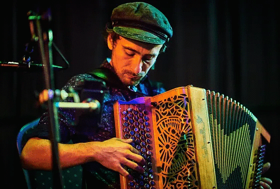

Aus Lausanne in der Schweiz stammend, entdeckte der Künstler bereits im Alter von acht Jahren seine Leidenschaft für die Musik. Erste prägende Erfahrungen sammelte er auf Reisen durch Frankreich, bevor er seinen ursprünglichen Beruf hinter sich ließ und in die Welt des Zirkus eintauchte. Dort arbeitete er zunächst hinter den Kulissen, bis er 2017 selbst den Schritt auf die Bühne wagte. Kurz darauf folgte mit dem Trio Baladins die erste Europatournee im Bal-Folk-Bereich.

Heute präsentiert er ein neues Solo-Projekt, das seine musikalische Reise auf persönliche Weise weiterführt. Eine erste EP ist in Arbeit – getragen von einem engagierten Team und der Lust auf neue Klangwelten.

Seit fast einem Jahrzehnt ist das Akkordeon sein treuer Begleiter. Seine Musik erzählt von bewegten Jahren zwischen Zirkuszelt und Konzertbühne, von außergewöhnlichen Orten und Momenten. Mit eigenen Kompositionen schafft er einen eindrucksvollen Klangkosmos, der Vergangenes lebendig werden lässt und zugleich neugierig auf das macht, was noch kommt.

*Julien Bohème – Akkordeon und Stimme*

- [Homepage](http://www.JulienBoheme.com)
- [Youtube](https://www.youtube.com/watch?v=zdAUVgR8iVM)

### Mara Menzel (D)

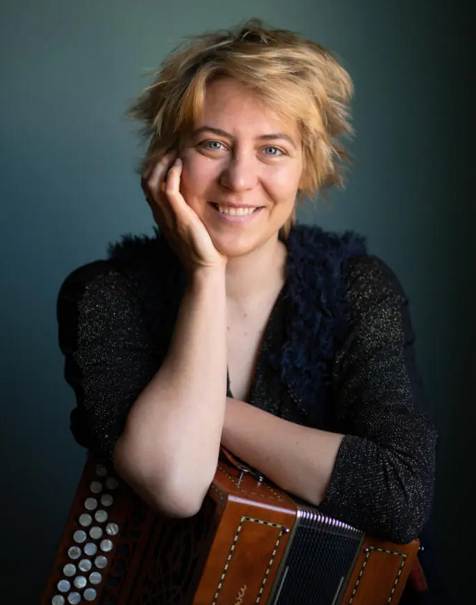

Ich singe in meinem Set meine eigenen Geschichten und Kompositionen und begleite mich dabei auf dem diatonischen Akkordeon, der Gitarre und der Kalimba. Das Balfolk Universum begeistert mich schon seit klein auf, zuerst fand ich meinen Zugang über den Tanz und dann musizierend mit verschiedenen Gruppen wie Stimmt so., meinem Solo, Lunesk und meinen Duos. Freut Euch auf Geschichten in Deutsch, Englisch, Französisch und Italienisch mal laut, mal leise, mal wild und zum dahin schmelzen.

*Mara Menzel – diatonisches Akkordeon, Stimme*

- [Homepage](https://queeringbalfolk.de/mara/mara-menzel-musik/)
- [Youtube](https://youtu.be/KSd87VGGST8?si=2RQ8k46edWbQu_eU)
- [Youtube](https://youtu.be/T33DDiHX390?si=gIOBoQOCQYRG7ehA)

### Zéphyr Combo (CH/B)

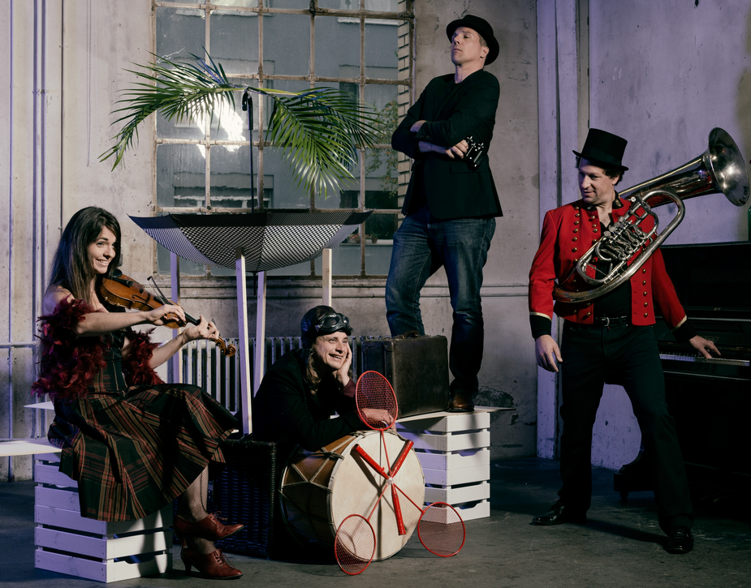

… kommen diesmal leider nur als Trio – dafür mit Helikon, Strombox, E-Gitarre – und jeder Menge Energie!

Zéphyr Combo vermischt Chanson mit Gipsyklängen, Handorgelrock, bissigen Satiren, wirren Trinkliedern und Träumereien. Dazu begleiten wir uns auf Akkordeon, Geige, Drehleier, Klavier, Gitarre, Helikon, und Trompete. Tönt ein wenig wie Brel, ein wenig wie Bregovic, aber vor Allem wie – Zéphyr Combo.

*Geert Dedapper – Akkordeon, Stimme, und allerlei*
*Esther Nydegger – Geige, Stimme, Querflöte, Gitarre*
*Leon Schaetti – Helikon, Stimme*
*Olaf Ryter – Schlagzeug*

Foto: Mischa Scherrer

- [Homepage](https://zephyrcombo.ch/)
- [Album](https://zephyrcombo.ch/?js_albums=face-a-lorage-bal-folk)

### Zèphyr Duo

.. wie oben als Duo, erfrischend anders, unglaublich vielseitig und mitreißend tänzerisch.

*Geert Dedapper – Akkordeon, Stimme, und allerlei*
*Esther Nydegger – Geige, Stimme, Querflöte, Gitarre*

## Workshops

Bei uns gibt es kein klassisches Workshop-Programm – denn das Programm entsteht durch euch. Alle Teilnehmenden sind eingeladen, zu teilen, was sie können, wissen und weitergeben möchten. Genau darin liegt der Kern unseres Festivals: gelebte Co-Kreation.
Ob ihr etwas zum ersten Mal anbietet, euch ausprobieren möchtet oder bereits Erfahrung mitbringt – traut euch! Alles, was euch bewegt, ist willkommen: Tanz- und Musikworkshops ebenso wie Yoga, Acro-Yoga, Improvisation, Bewegung aller Art, Meditation, Klangreisen, Lesungen, Gespräche, Kinderangebote, gemeinsame Wanderungen oder Wissensformate. Eurer Fantasie sind keine Grenzen gesetzt.

Vor Ort entsteht ein gemeinsamer Zeitplan, in den ihr eure Angebote selbst eintragt – ihr entscheidet, wann und wo euer Workshop stattfindet. Zur Verfügung stehen unser großer Tanzsaal (außerhalb von Frühstück, Soundchecks und Konzerten), ein kleiner Workshopraum sowie der Garten und die umliegende Natur.
Wenn ihr im Voraus eine Idee habt und euch einen bestimmten Ort oder Zeitpunkt sichern möchtet, schreibt uns gern (Kontakt siehe unten).

In den vergangenen Jahren ist so ein inspirierendes, vielfältiges Workshopprogramm entstanden – getragen von Menschen, die das teilen, was sie lieben. Wir freuen uns darauf, diese besondere Energie auch in diesem Jahr wieder gemeinsam mit euch zu gestalten.

## Anreise und Ort

### Anreise

**Adresse**
[Bühl 6, 91245 Simmelsdorf, Deutschland](https://osm.org/go/0JRCUDqLF-?m=)

**mit Öffis**
Die Schnaittachtal-Bahn (RB 31) fährt im 1h Takt von Nürnberg Hauptbahnhof, Fahrtzeit ca 40Min. Endstation ist der Bahnhof **Simmelsdorf-Hüttenbach**. Von dort sind es etwa 10 Minuten Fussweg (bergauf!).

**mit Auto**
von der A9 Autobahnausfahrt Schnaittach Richtung Simmelsdorf. In Simmelsdorf an der Kreuzung Richtung Diepoltsdorf gerade aus, dann die nächste kleine Straße rechts hoch Richtung "Bühl".

### Gemeindehaus und Tanzsaal

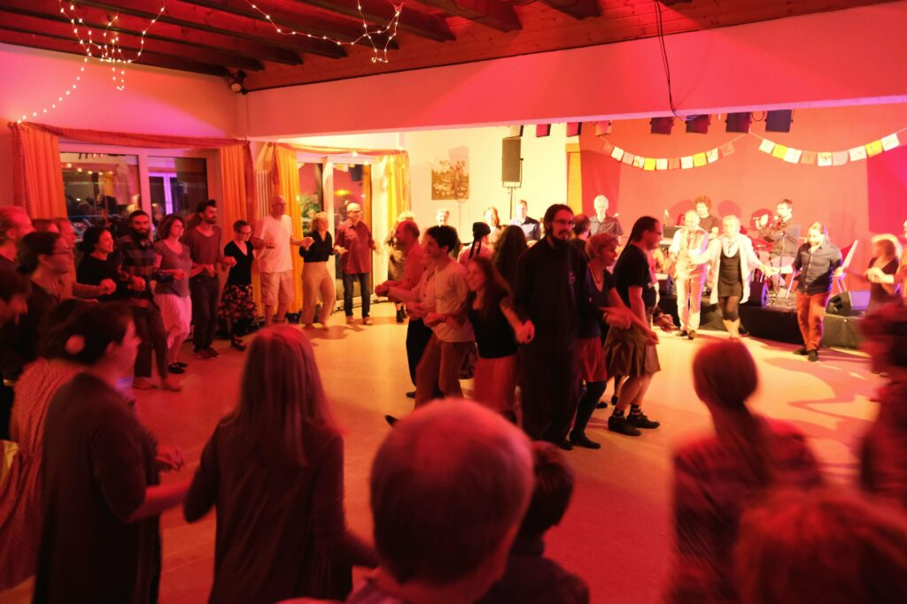

Wir tanzen im Gemeindesaal der Kirchgemeinde Mariä Heimsuchung. Es gibt Platz für 100 Tanzende mit gutem Tanzboden. Für die Musiker wird eine Bühne aufgebaut.

Neben dem Tanzsaal gibt es im Gemeindehaus auch eine ausgestattete Küche, die zum Zubereiten der gemeinsamen Speisen verwendet wird. Im Garten werden Tische und Bänke stehen, um bei schönem Wetter draußen zu essen und verweilen.

## Unterkunft und Verpflegung

### Schlafsaal

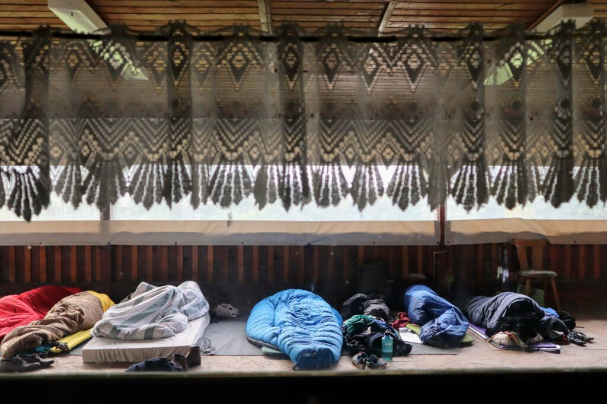

**Anreise: Donnerstag ab 15 Uhr**
**Abreise: Montag bis 12 Uhr**

Wir dürfen uns im Vereinsheim des SV Achteltal ein Matrazenlager einrichten, ca 5 Gehminuten vom Tanzsaal. Hier gibt es Toiletten, Gemeinschaftsduschen, eine Küche, Heizung. Bringt alles mit, um es euch gemütlich zu machen – Isomatten, Decken, Schlafsack etc. Wenn der Innenraum voll ist, kann man auf die Terrasse ausweichen, da kann es frisch sein!

### Camping

**Zelten**
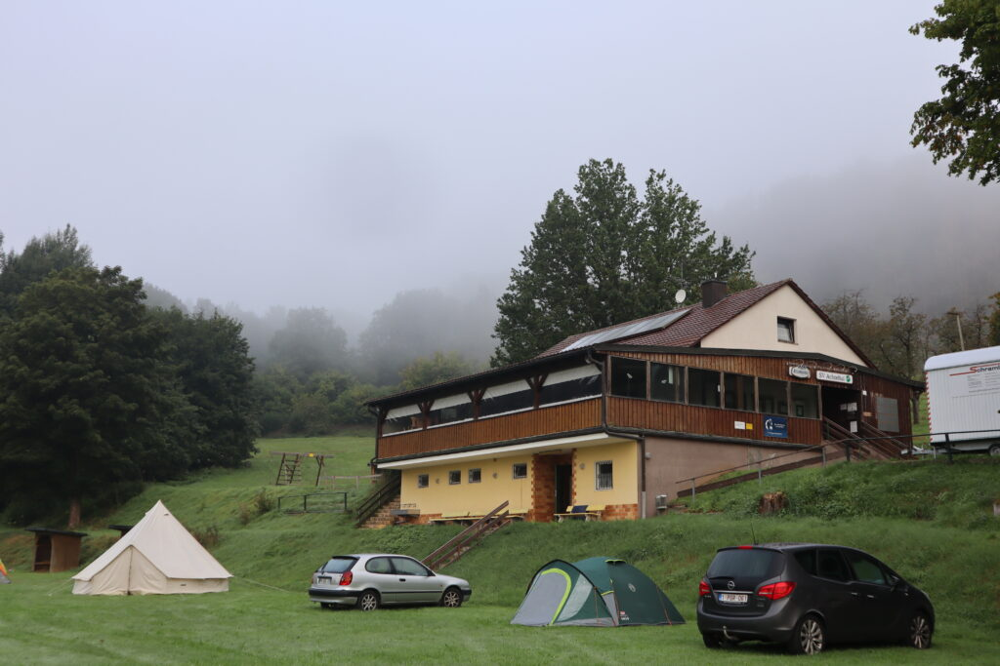
Auf dem Fußballplatz des SV Achteltal dürfen wir zelten. Toiletten und Duschen befinden sich im Gebäude. Bitte keine Autos auf den Rasen und kein offenes Feuer.

**Wohnmobile**
Euren Van / Wohnmobil / Auto könnt ihr oben, direkt neben dem Tanzsaal auf den Wanderparkplatz stellen. Alternativ einreihig entlang der Walnussallee, ein paar Plätze gibt es auch am Sportheim. Ihr könnt die Toiletten und Duschen des Vereinsheims benutzen.

### Privatunterkunft

- [Gemeinde](https://www.simmelsdorf.de/Ferienwohnungen.n92.html)
- [AirBnB](https://www.airbnb.de/s/Simmelsdorf--Deutschland/homes)
- [FeWo-direkt](https://www.fewo-direkt.de/search/keywords:simmelsdorf-bayern-deutschland/)

### Verpflegung

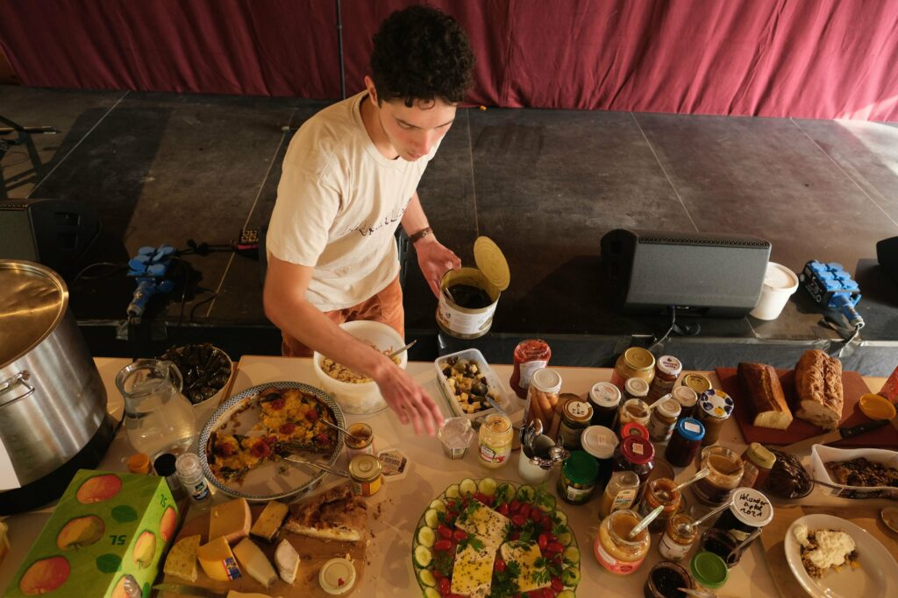

Am Donnerstag abend gibt es ein Mitbringbuffet – **_Bitte bringt was fürs gemeinsame Abendessen mit!_**

**Frühstücksbrunch** Freitag, Samstag und Sonntag von 8:30 – 12 (bis 14 im Garten) Uhr wird es ein Mitbring-Frühstücks-Brunch-Mittagsbuffet geben.
Es gibt Kaffee, Tee, Milch, Joghurt, Haferflocken, Brot, Butter, Marmelade.
**Bringt gerne was aus eurer Gegend zum Teilen mit, um das Frühstücksbuffet bunter zu machen: Käse, Marmelade, Aufstrich – was Ihr am liebsten mögt.**
Kuchen geht immer 🙂

**Abendessen**
Freitag, Samstag und Sonntag Abend kochen wir gemeinsam einen riesigen Topf einer saisonalen Abendspeise. Es wird eine vegane/ vegetarische Suppe oder Eintopf sein, Specials gerne mitbringen. Pimp my Eintopf.

Das Brot beziehen wir von **lokalen** Bäckereien, unsere Lebensmittel sind **bio, regional und saisonal.**

**Getränke**
Rund um die Uhr gibt es bestes Simmelsdorfer Leitungswasser, Tee und Kaffee ist gratis.
Lokales fränkisches Bier, Wein, Limo, usw wird von der Brauerei Kanone, Schnaittach, zu günstigen Preisen zur Verfügung gestellt.

## Anmeldung und Teilnahme

### Anmeldung

Dieses Jahr wird es 2 Anmeldeslots geben. In den letzten Jahren waren Tickets nach wenigen Stunden ausverkauft, deshalb machen wir dieses Jahr zwei Slots, bei denen jeweils die Hälfte der verfügbaren Tickets vergeben wird.

—-> **Sonntag, 05.07.2026 um 11:11 Uhr**

—-> **Donnerstag, 09.07.2026 um 20:20 Uhr**, jeweils über diesen Button

Wir brauchen euch! Als DCKN Mitglied unterstützt ihr dauerhaft und wirkungsvoll unsere ehrenamtliche Arbeit. Ihr profitiert von eurer Mitgliedschaft, indem ihr 24h vor dem offiziellen Anmeldestart am 05.07. Zugang zur Anmedlung durch einen CODE per Email bekommt und euch anmelden könnt.

[Anmeldung](https://eveeno.com/167891942)

### Kosten

Wir kalkulieren alle Kosten und teilen Sie unter allen Teilnehmenden auf.
Das entspricht **130-160€** für das Wochenende, Schüler:innen und Student:innen **99€**, Kinder bis 15 Jahre **kostenlos / Spendenbasis**.
Uns ist wichtig: Gleich bedeutet nicht für alle das Gleiche. Es liegt in eurem Ermessen, wie viel ihr geben könnt. Es gibt die Möglichkeit einen kleinen oder größeren Betrag zu spenden. Damit unterstützt ihr unsere Orga und schafft Raum für Menschen mit weniger Einkommen. Danke schonmal!
Sollte der Betrag für euch eine Hürde darstellen, meldet euch gerne bei uns, wir finden eine Lösung.

Im Beitrag enthalten ist das gesamte Festivalerlebnis: 4 Nächte und 3 Tage voller Musik und Tanz, alle Konzerte und Technik, Frühstücksbrunch und Abendessen, Übernachtungsmöglichkeiten – und ganz viel Herz.

### Storno

Es wird dieses Jahr keine Warteliste geben. Die Tickets sind nicht personengebunden und ihr könnt sie selbst auf den gängigen Kanälen weitergeben. Es gibt keine Tagestickets, ihr könnt aber selbst suchen, ob jemand mit euch ein Ticket "teilen" möchte.

### Kontakt

Bei Fragen und Ideen einfach melden!

[Email](mailto:simmelfolk@dckn.de?subject=%5BDckN%5D%20Anfrage%20zum%20Simmelfolk%20Festival)

[Anmeldung](https://eveeno.com/167891942)
