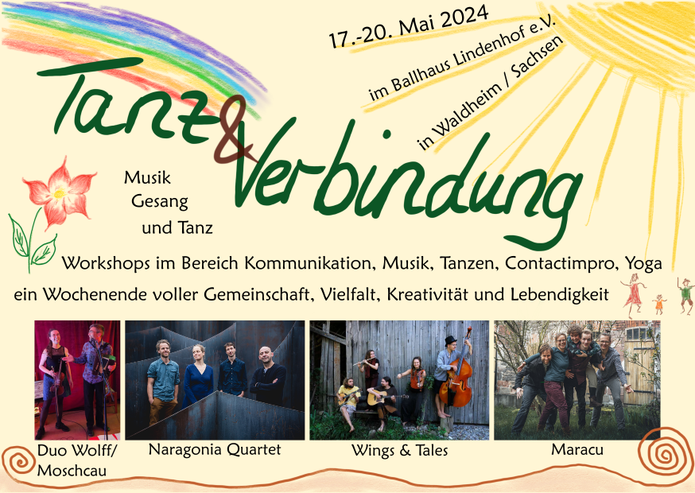
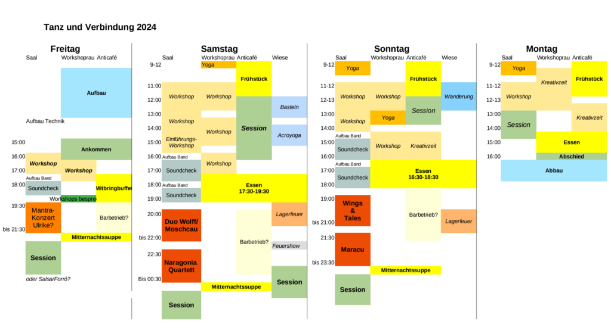
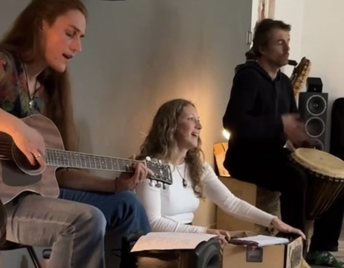
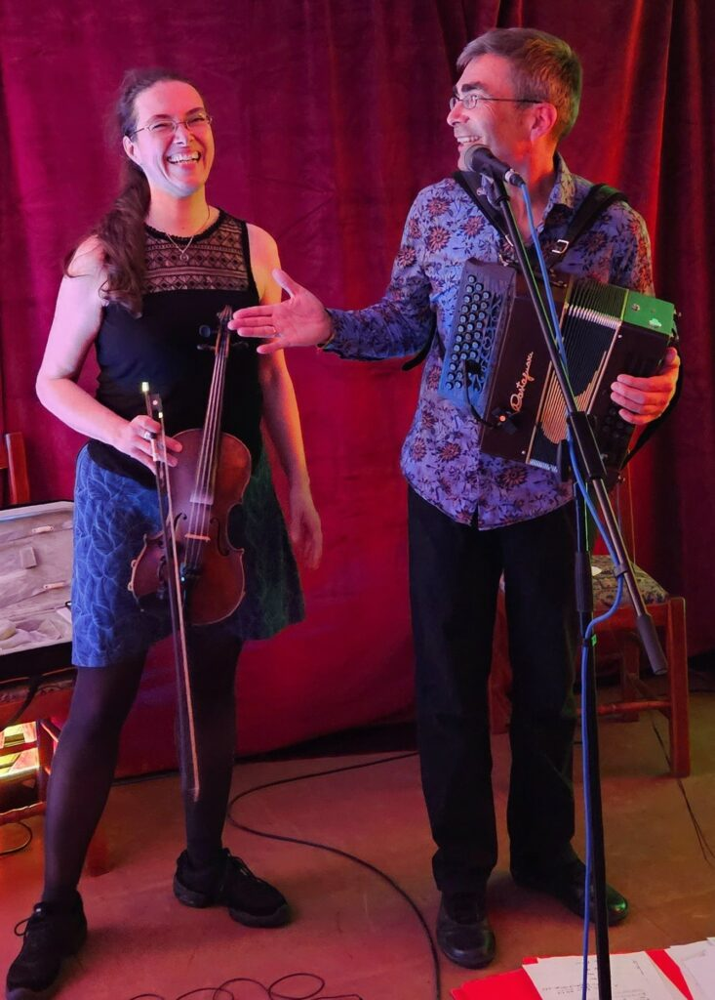
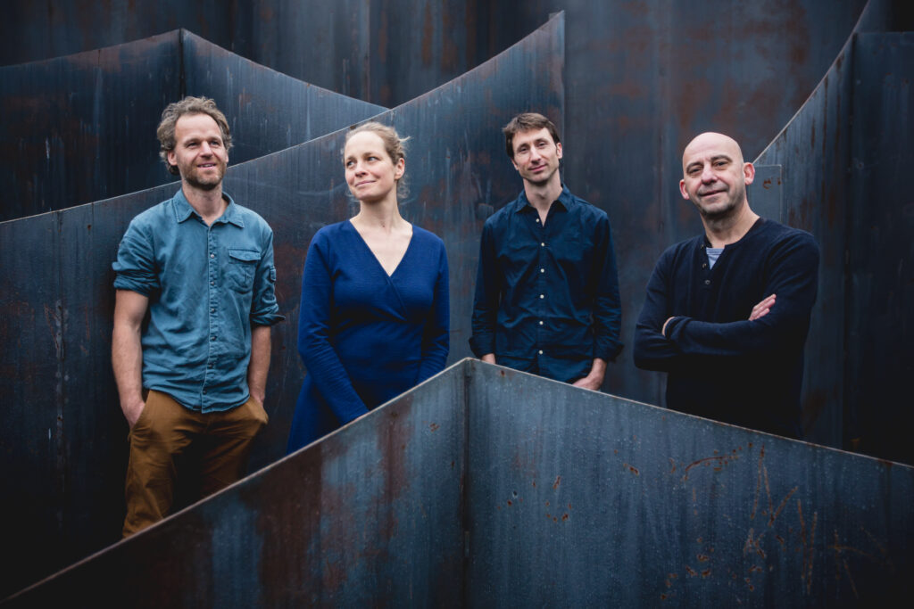
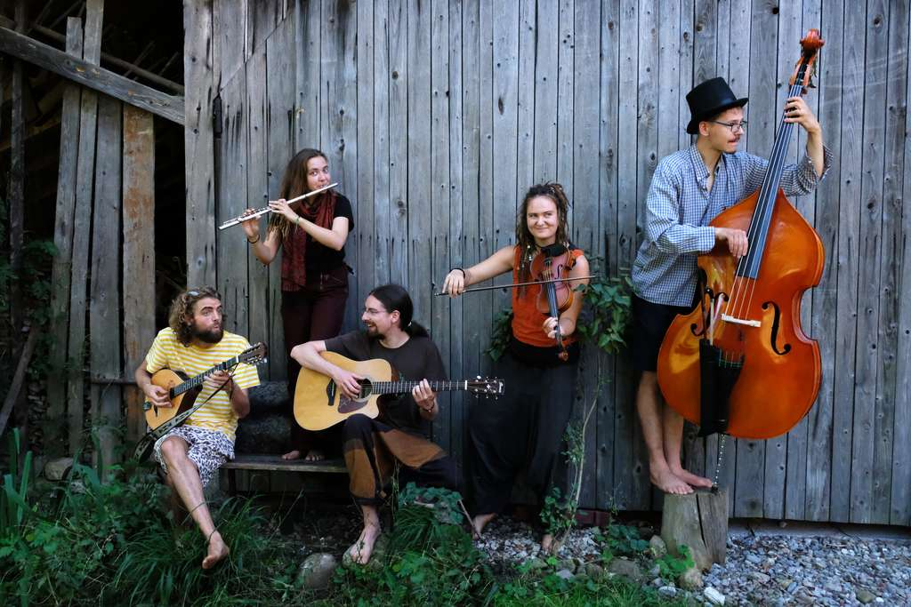
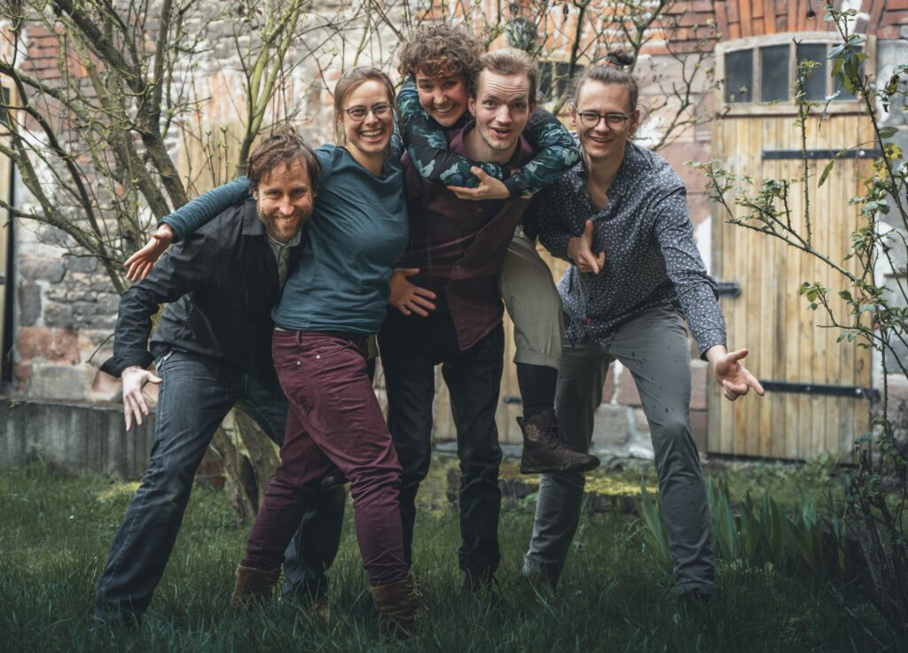
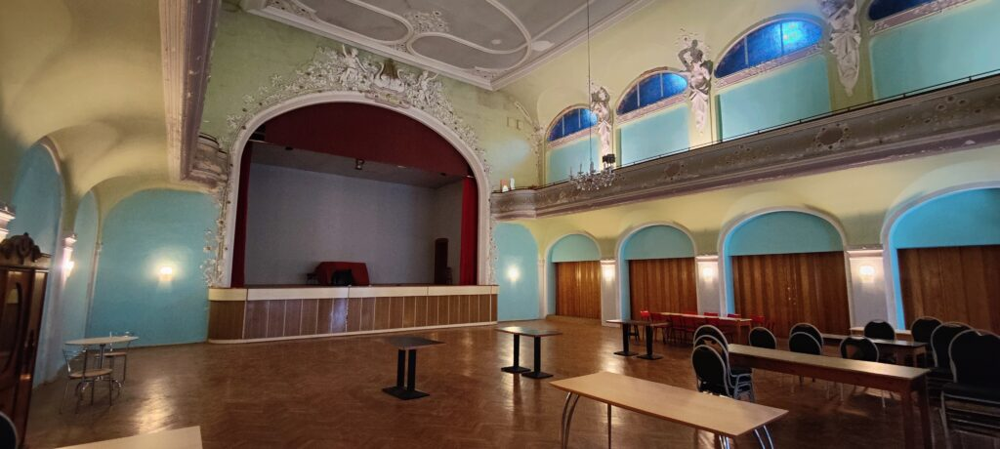
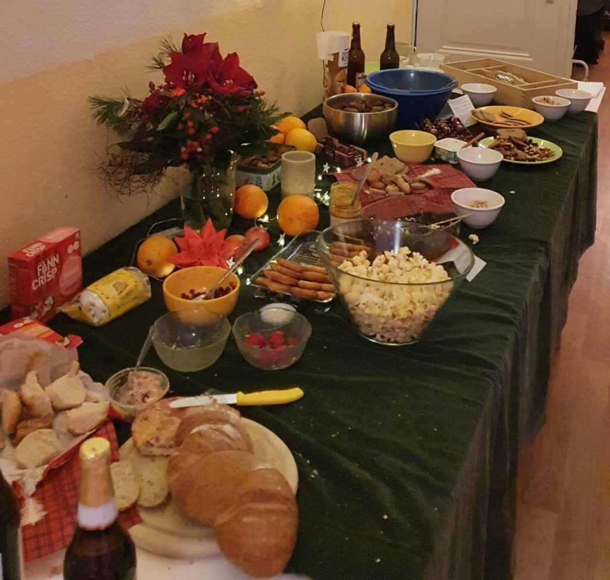
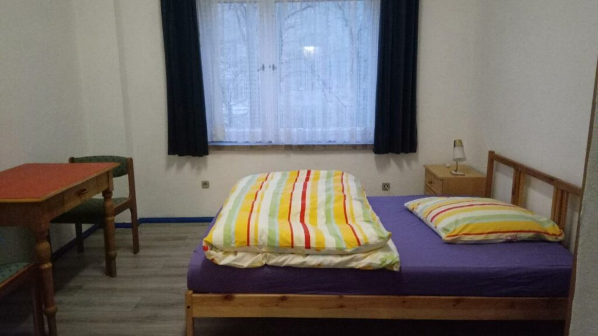

## Tanz und Verbindung 2024

**17.-20.05.2024 in Waldheim in Sachsen**

Zu Pingsten lassen wir im und um das Ballhaus Lindenhof ein Wochenende voller Gemeinschaft, Kreativität und Lebendigkeit entstehen.
Diverse Workshops im Bereich Musik, Tanzen, Contactimpro, Yoga, Kommunikation und Kreativangebote laden ein, sich zu Spüren und miteinander in Kontakt zu kommen. Das Angebot entsteht durch die Teilnehmenden des Wochenendes, die sich mit ihren verschiedenen Qualitäten einbringen.
Willkommen sind dabei Menschen jeglichen Alters – sehr gern in der ganzen Familie, jeglicher Hautfarbe, Herkunft, Glaubensrichtung, Geschlechtsidentität oder sexueller Orientierung.
Du darfst hier so sein, wie du bist. Gewalt und berauschende Drogen haben hier allerdings keinen Platz.
Wir wünschen uns ein friedvolles, unterstützendes Miteinander, wo jede:r auf den anderen Menschen achtet und sie/ihn in seiner/ihrer Einzigartigkeit respektiert.

Tagsüber finden Workshops statt, abends gibt es Musik und Tanz mit ???, [Naragonia Quartet](https://www.naragonia.com/en/quartet/), Duo Wolff/Moschcau, [Maracu](https://maracu.de/) und Wings and Tales.

Die Webseite wird laufend aktualisiert, wenn sich neue Informationen ergeben.

Bisher gibt es folgende **Workshopangebote**:
Jonglieren, Steine bemalen (mit Acrylfarben), Freundschaftsbänder flechten, knüpfen, …
Körperarbeit/Feel at home in your body, Yoga (am Sonntag), Kinder-Yoga, Acroyoga, Contact Impro Jam
Wheel of Consent, Ehrliches Mitteilen, Krafttierreise für Kinder, Augenkontakt-Meditation
Austauschformat Gestalten des Miteinanders in der BalfolkSzene, Workshop Verbindung im Tanz
Okzitanische Lieder, Vocal Painting (Improvisationschor), "Ein-Klang" Atem/Stimme/Körper/Klang
Anfängerworkshop Balfolk, Schottisch mit Figuren, Forró, Kreistänze, Mixer-Variationen für Fortgeschrittene

Bitte bringt euch Yogamatten und/oder Decken für die Wiese mit.

Der genaue Workshopplan wird vor Ort festgelegt.

## Programm

### FREITAG 17.05.

**Mantra-Mitsing-Konzert – 19:30 Uhr**

Gemeinsam mit euch wollen wir in die Welt der Mantren und Herzenslieder eintauchen.
Dabei dürft ihr eure Stimmen ganz frei und ungezwungen erklingen lassen oder einfach nur den Klängen lauschen.
Lasst euch von den Liedern, Klängen und Stimmen tief im Herzen berühren und verzaubern.
Instrumental begleiten wir den Abend mit einem indischen Harmonium, einer Gitarre und verschiedenen Trommeln.
Wir freuen uns auf euch.

Silvia, Thomas und Ulrike

### SAMSTAG 18.05.

**Duo Wolff/Moschcau – 20:00 Uhr**

Hier treffen sich Geige und diatonisches Akkordeon und lassen Melodien erstrahlen, die voller Wärme und Lebendigkeit zum Bal Folk einladen. Mit Karola Wolff und Thomas Moschcau haben sich in diesem Duo zwei Musiker zusammengetan, die selbst gern tanzen.

**Naragonia Quartett – 22:30 Uhr**

Die 4 Musiker verzaubern mit ihrer Musik zum Tanzen, Zuhören und Träumen.
Sie spielen die klassischen Tänze des Balfolk und bringen uns damit in Paaren, Kreisen oder Ketten zum Tanzen.

[Naragonia](https://www.naragonia.com/en/)

### SONNTAG 19.05.

**Wings & Tales – 19:00 Uhr**

Natur, Mehrklang, Tanzparty und Liebe. Unser Balfolk ist eine Reise zu lebenfrohen Melodien, stampfenden Rhythmen, einfühlsamen Texten und dem Zauber der Natur.
[https://www.wingsandtales.de/](https://www.wingsandtales.de/)

*Geige, Vocals, Obertongesang – Fili*
*Rhythmusgitarre, Vocals, Rahmentrommel – Martin*
*Kontrabass, Vocals – Niklas*
*Flöte, Vocals – Helena*

**Maracu – 21:30 Uhr**

Bal? Folk! aus Leipzig
Inspiriert von den feinsten Tänzen, die wir vielerorts aufgabeln konnten, haben wir Grooves und Melodien zusammengeschnürt. Die lassen wir mal harmonisch davon fliegen und mal fangen wir sie sanft wieder ein. Wir lassen Klangkonfetti regnen und gehen mit euch in fetten Sounds baden! Und wenn sich die Tanzbeine dabei richtig ausgetobt haben, dürfen sie zu Ohren werden und den Geschichten lauschen, die von einer nächtlichen Begegnung mit Jazz und Klezmer erzählen…
[https://maracu.de](https://maracu.de)

*Violine – Josefine Schlät*
*Schlagzeug & Percussion – Michael Kock*
*Kontrabass – Niklas Jacob*
*Klarinette – Luzia Walsch*
*Gitarre & Charango – Matthias Glatthorn*

## Veranstaltungsort

Wir tanzen im imposanten Grünen Ballsaal im [Ballhaus Lindenhof](https://gruenesballhaus.jimdofree.com/gr%C3%BCner-ballsaal/) in Waldheim, mitten in Sachsen.
Waldheim ist ungefähr im Mittelpunkt zwischen Leipzig, Dresden, Chemnitz.

**Lindenhof**
Mittweidaer Str. 5A
04736 WALDHEIM

Vom Bahnhof sind es 1,2 km zum Ballhaus.
Die Parkplatze am Haus sind als Übernachtungsplätze reserviert, weitere sind nur entlang der Straße zu finden oder im Zentrum gibt es noch Stellflächen.

## Essen

Freitag Abend gestalten wir ein gemeinsames Mitbringbuffet ab 17:30.
Es gibt eine Küche, in der sich Küchenteams um die gemeinsamen Mahlzeiten kümmern werden.
Frühstück jeweils 9 – 12 Uhr
1 warme Mahlzeit ca 16:30 – 18:30 Uhr
Mitternachtssnack Fr, Sa und So

## Schlafen

Nach dem Tanzen braucht es die Möglichkeit zum Ausruhen.
Es gibt direkt im Lindenhof einige Zimmer zum Übernachten (3-6 Personen, mit Dusche/WC).
Außerdem ist es möglich, auf der Wiese zu zelten oder im Hof im Auto zu schlafen.
Für die Zelter und "Autoschläfer" werden Außenduschen installiert.

Im Zentrum von Waldheim befindet sich in 15 Minuten fußläufiger Entfernung das Hotel Goldener Löwe.

## Kleidertausch/Verschenketisch

Ihr könnt ein paar Kleidungsstücke mitbringen, die nicht mehr getragen werden, aber in gutem Zustand für neue Besitzer sind und sucht euch etwas aus von den vorhandenen Dingen. Kleidungsstücke für Menschen jeden Alters, Schuhe, CDs, Bücher. Es ist auch möglich, nur zu finden.
Was übrig bleibt, geht an Unterstützungsprojekte für Menschen, denen es weniger gut geht im Leben.

## Co-Kreation

wie ihr sie vom SimmelFolk Festival und MärzTanz Festival schon kennt:

Dieses Festival ist ein **Gemeinschaftsprojekt**.
Es lebt mit euch, durch euch, von euch.
Ohne euch gibt es kein **Tanz und Verbindung** Wochenende.

Jede:r ist eingeladen sich mit ihren/seinen Fähigkeiten, Energie und Präsenz einzubringen, um das Festival mitzugestalten, egal ob als Musiker:in oder Workshopleiter:in, beim Kochen, vorbereiten oder aufräumen.
Jede:r Teilnehmende trägt ein oder zwei kleine "Ämtli", so erschaffen wir das **Tanz und Verbindung** Wochenende – das ist Co-Kreation.

Meldet euch gern, wenn ihr euch in der Organisation im Vorfeld oder direkt vor Ort mit eigenen Ideen und tatkräftigen Händen einbringen wollt.
