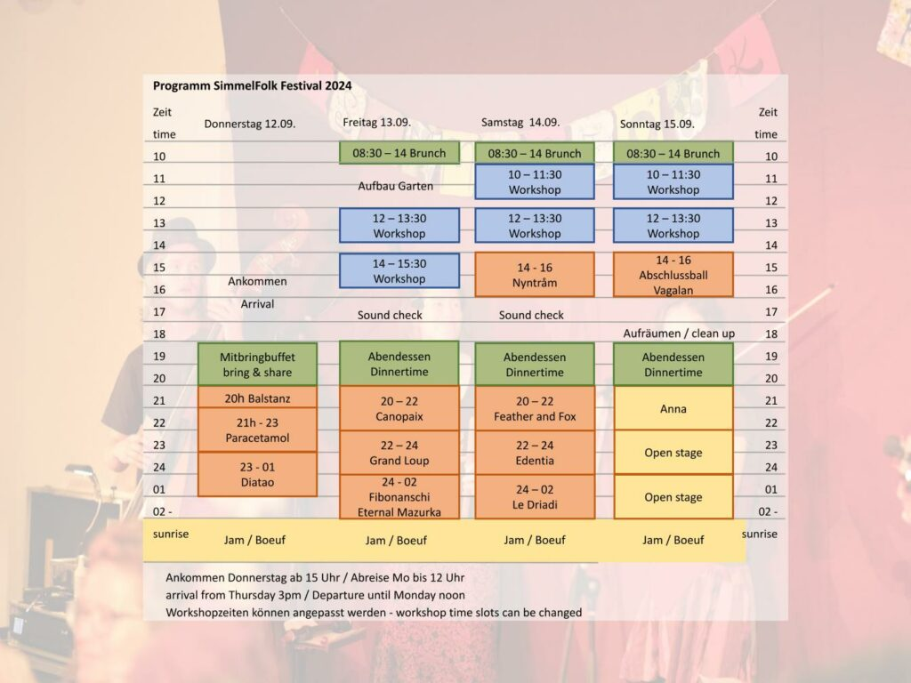
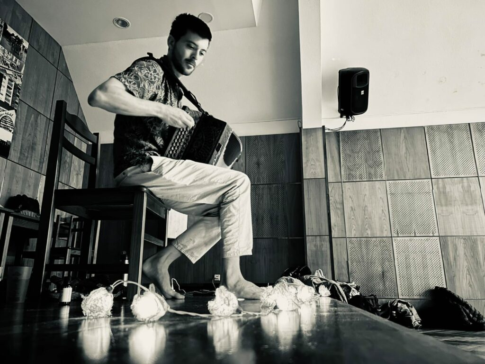
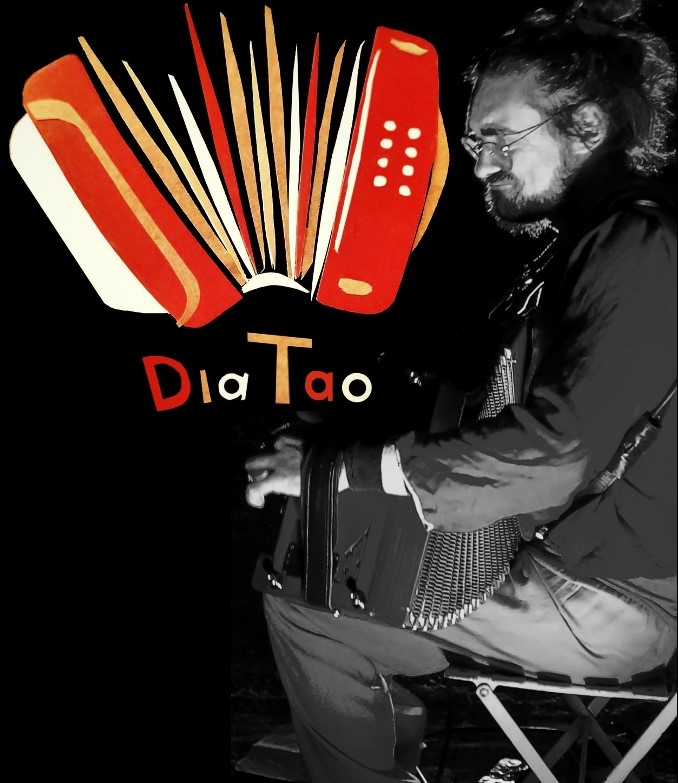
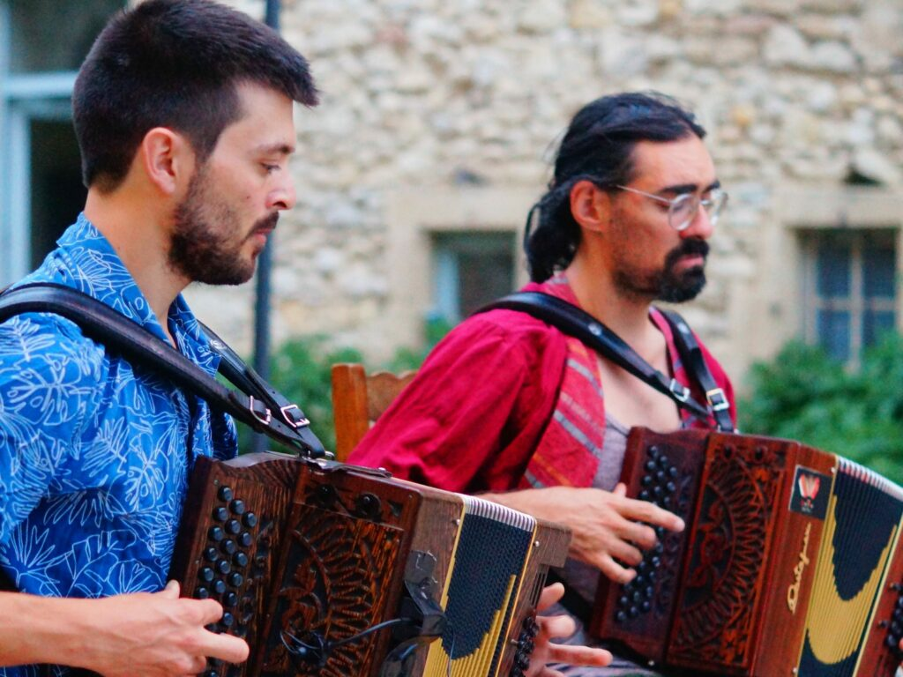
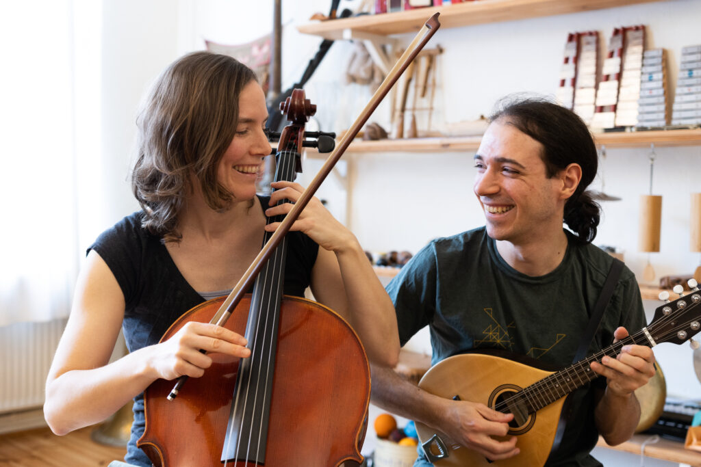
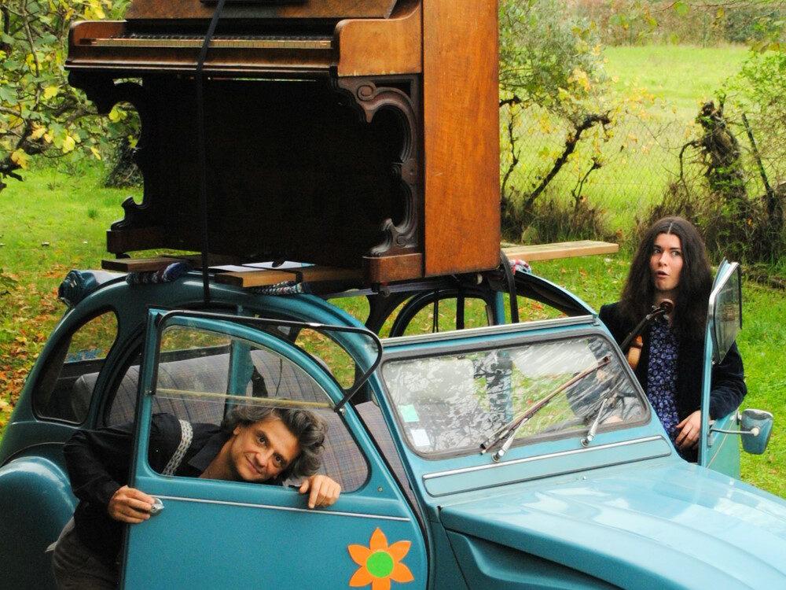
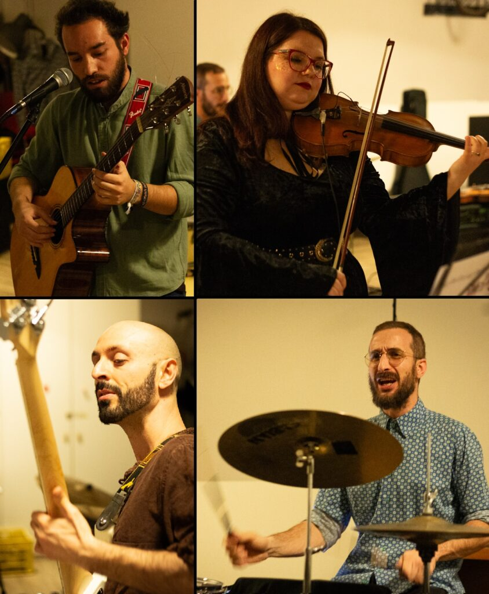
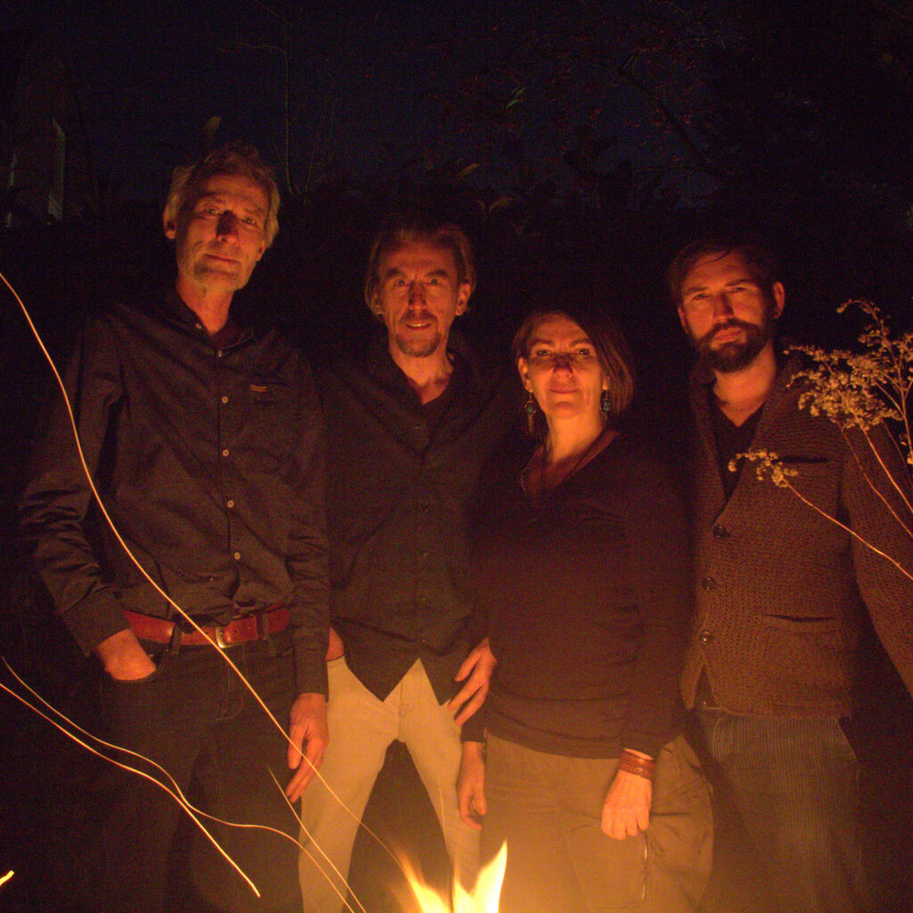
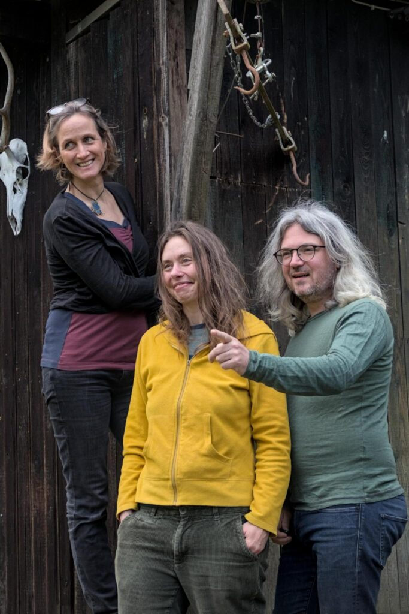

## SimmelFolk Festival 2024

Das diesjährige SimmelFolk Festival wurde durch die Kulturförderung des Bezirks Mittelfranken mit einem Betrag von 500€ gefördert.

Vielen Dank dafür!!

## Bands

### Canopaix

Ein Atemzug, ein Schritt, ein Tanz, eine Bindung, die entsteht, ein Funke, der das Herz erleuchtet.
Matthieu lädt euch ein, in seine Welt einzutreten, begleitet vom Klang des Akkordeons, zu einem intimen Ball, inspiriert von seinen farbenfrohen Kompositionen.

Matthieu Meyer (F), diatonisches Akkordeon

### DiaTao

DiaTao is a powerfull and subtle solo with diatonic acordion. A bal folk proposition made of composition and danses from britanny to gascogne, groovy and heavy. Loud base and sparkling melodies at the service of dances

Tao Dumur (F), diatonisches Akkordeon

- [Facebook](https://www.facebook.com/DiaTaoBal2/)
- [Youtube](https://youtu.be/oBIPW4SPaUs?si=p8YZ94RPxsonAv-o)

### Edentia

A duo of diatonic accordions mixing personal compositions and picked melodies. A bal of ice and fire between energy and delicacy.

Matthieu Meyer (F), diatonisches Akkordeon
Tao Dumur (F), diatonisches Akkordeon

- [Youtubekanal](https://www.youtube.com/@edentia7159)
- [Youtube](https://www.youtube.com/watch?v=hVt79rFkmlY)

### Feather and Fox

ist ein belgisch-deutsches Balfolk Duo. Victor und Christiane lernten sich in einem Berliner Sommer am Spreeufer kennen. Von Beginn an spielt das Duo für Tänzer:innen und lässt sich von deren Energie inspirieren. Verspielt und feinfühlig erkunden sie die Klangmöglichkeiten im Zusammenspiel der zwölf Saiten von Mandoline und Cello und kreieren damit einen einzigartigen Klang, zugleich federleicht und energiegetrieben.

Christiane Bisitz (D) Cello, Gesang
Victor Lekeu (B) Mandoline

Foto: Maciej Sowilski

- [Youtube](https://www.youtube.com/@FeatherandFox)
- [Facebook](https://www.facebook.com/featherandfoxduo)

### Fibonanschi: Eternal Mazurka

We all love a romantic mazurka, finding into deep connection to ourselves, to the music and with each other…

But what if the mazurka didn't stop after 5 or 10 minutes? If it just kept going, carrying us further and further into the dreamy landscapes of our souls?

Forget time and space while you dive deep into this dance, dare to experiment, take your time to find your rhythm, and express it in a beautiful flow.

Angela Solothurnmann (CH), chromatisches Akkordeon

- [Youtube](https://www.youtube.com/@fibonanschi5475)
- [Homepage](https://fibonanschi.ch)

### GrandLoup

Louise und Patrick haben sich unter einer Brücke kennengelernt .. am Ufer der Loire. Sie kombinieren Musik, Lieder und Tanz und formen daraus ihr Bal Folk Duo GrandLoup. Euch erwarten sowohl originelle Lesarten des Folk-Repertoirs als auch unveröffentlichte Kompositionen. Inspiriert von der Renaissance der Neo-Folk-Gruppen möchten Louise und Patrick dem Tanz dienen und Emotionen hervorrufen, indem sie aus der Vielfalt der Einflüsse schöpfen, die ihren musikalischen Werdegang geprägt haben.

Louise Legrand (F), Violine, Gesang
Patrick Chamblas (F) Piano

- [Homepage](https://artamis.wixsite.com/grandloup?fbclid=IwAR0zuGn5FbuX4NMUhQQ7W6ofxB-icAhQZ5Oz57XmCVq_dEh4tEwJbs4Loms)
- [Youtube](https://youtu.be/yclBel0biu8)

### Le Driadi

ist eine italienische Balfolk-Gruppe, die Ende 2023 geboren wurde und wie Waldnymphen unveröffentlichte Stücke mit italienischen Singer-Songwriter-Einflüssen verwebt. Balfolk steht im Mittelpunkt des Projekts und umfasst französische Tänze, romantische Mazurken, Mixer und bretonische Ketten. Bei SimmelFolk wird die Band als Quartett auftreten, das die Magie von Rhythmus und Musik mit der vokalen Poesie des italienischen Singer-Songwritings mischt. Es entsteht ein klanglicher Wald, in dem jede Note ein Zauber ist und die Zuhörer einlädt, sich in der Welt aus Musik, Tanz und Magie zu verlieren!

Alessandro (I), Stimme, Gitarre
Alessandro (I), E-Bass
Diana (I), Violine
Dino (I), Cajon

- [Video](https://www.youtube.com/watch?v=9N5ReZdrTyk)
- [Facebook](https://www.facebook.com/Ledriadimusic/)
- [Insta](https://www.instagram.com/ledriadi/)

### Nyntråm

Urbaner Scandi-Folk zum Mittanzen

Angela Solothurnmann und Elena Konstantinidis nehmen euch mit in die Dämmerung der schwedischen Mittsommernacht. Im Puls von Polska, Slängpolska, Vals, Schottis und vielen anderen skandinavischen Tänzen schweben wir mit euch bis in den Morgen…

Angela Solothurnmann (CH), chromatisches Akkordeon
Elena Konstantinidis, Nyckelharpa, Geige

- [Facebook](https://www.facebook.com/nyntram)
- [Youtube](https://www.youtube.com/watch?v=4qt4o5zmvM4)

### Paracetamol

… ein Quartett aus den Niederlanden, spielt bittersüße Balfolk-Musik. Hinreißende Mazurkas, schwingende Gavottes, fließende Bourrées, aber auch eine seltene Grabbelton und die erste neue Bravade seit 1657.
Vor einem Jahr haben wir unser neues Album veröffentlicht und das in den Niederlanden, Frankreich, Belgiën, Deutschland und Polen präsentiert.

Jan Willem Veenhuis – Gitarre
Gyöngyi Kovács – Kontrabass
Nico Beltman – Violine, Dudelsack
Rob Zantkuijl – Flöte, Dudelsack

- [Youtube](https://youtu.be/KyWwkXwGO3M?si=IG636RWoi-lwDLJg)
- [neues Album auf Spotify](https://open.spotify.com/intl-de/artist/5s258edNJhduuInnpRWeOA)
- [Homepage](https://www.paracetamolfolk.nl)

### Vagalan (D, F)

ist eine nagelneue Band, die sich Anfang 2024 zusammengefunden hat, aber alles andere als unerfahren ist. Samuel Aubert gestaltet seit 15 Jahren die Tübinger Balfolk-Szene mit und groovt sich auch mal ganz alleine mit seiner Geige durch einen kompletten Ball. Anna Gaide (diatonisches Akkordeon) und Annika Brunel (Klarinette, Fagott, Oboe, Flöten aller Größen) machen seit 2018 gemeinsam Musik und basteln unermüdlich an Kompositionen in außergewöhnlichen Tonarten, Harmonien und Rhythmen. Außer ihrer Musik verbindet die drei ihre Liebe zu Frankreich, gutem Essen und kleinen Holzhäuschen.

Mit viel Groove und Leidenschaft spielen Vagalan ausschließlich Eigenkompositionen der drei Mitglieder. Ihr Repertoire umfasst neben Balfolk-Klassikern und einer erlesenen Auswahl von „ungeraden" Walzern auch eine gesalzene Prise an bretonischen Tänzen.

Samuel Aubert: Geige, Gesang
Annika Brunel: Klarinette, Fagott, Oboe, Flöten
Anna Gaide: Diatonisches Akkordeon
